.. toctree
   :maxdepth: 2
   :caption: Beginners Guide

   Introduction
   Beginners Guide
    Account Management
   Typical Working Process

.. image:: _static/media/Images/1/of_logo.png
   :width: 150
   :align: left
   :alt: OF logo

OPEN FORIS ARENA
================
**Arena** is an Open Foris cloud-based platform for survey design,data management,utilization and processing in field-based inventories.
This is the official documentation for Arena.

.. tip::
   **Instruction to read documentation**

   - The documentation is divided into modules arranged logically to enhance comprehension.
   - Each chapter includes easy to follow steps with tips and screenshots provided.
   - Code examples are highlighted in code blocks.
   - Use the navigation bar on the left to find specific topics.
   - If you are new to Arena,start with the **Beginners Guide** that provides a gentle introduction to the interface,tools and user functions.Experienced users can skip to the modules.
   - If you are stuck,check the **Troubleshooting Chapter** or explore the **Annexes** for additional resources.
  

INTRODUCTION
============
Welcome to Open Foris' Arena Documentation! This introductory chapter presents Arena- showcasing its offerings,advantages and limitations.

Overview of Open Foris Arena
----------------------------
**Arena** is an Open Foris (OF) cloud platform for forest inventory data collection, management, analysis, dissemination and reporting. It combines two current tools, namely OF Collect and OF Calc, into a seamless application.

Open Foris Arena serves as the main entry point for data collected in field-based inventories. Consequently,the tool is designed to provide online solutions for field data management; allowing full customization of inventory structure, variables, and data checks. 

Arena versus the legacy Open Foris Tools.
^^^^^^^^^^^^^^^^^^^^^^^^^^^^^^^^^^^^^^^^^

Compared to the legacy OF tools,Arena offers the following advantages:

- No need for user installations;
- All data stored in a secure server in the cloud (hosted by Amazon Web Services, AWS);
- Data sharing and collaboration possible in a working group;
- Easier to maintain: all updates available at the same time for all users;
- No need for trained personnel to maintain the hardware and database management system.
- Ensures data quality through an integrated data entry and data cleansing workflow.
- Arena contains a formal description (i.e., metadata) of the types of variables, classifications and coding schemes used by the inventory.
- Ease of intergration : Older OF Collect surveys and data can also be imported into Arena.
- Arena handles multiple data types and complex validation rules, all in a multi-language environment.

What does OF Arena offer?
^^^^^^^^^^^^^^^^^^^^^^^^^
- Dynamic form designer.
- Multilingual data entry forms.
- Editor for entering complex validation rules.
- Categories and taxonomies management.
- Multiple surveys management.
- Survey templates management.
- Multi-cycle survey management.
- Map with access to high-resolution satellite data.
- Map queries using the power of Google Earth Engine via Earth Map. 
- Sample-based image interpretation.
- Import for OF Collect survey and data.
- Possibility to use multiple species lists; a species list can contain extra properties.
- Concurrent data entry with workflow and real time updates.
- User management with personal access rights.
- Survey backup (export, import), and cloning.
- Dashboard with activity logs.
- Data query, cleansing, export.
- Local off-line installation and usage via `docker <https://github.com/openforis/arena/blob/master/README.md>`_
- Data analysis with local RStudio or RStudio Server. [1]

Limitations of Arena
^^^^^^^^^^^^^^^^^^^^
Like any platform Arena has its own share of constraints namely:

- While the service is free, the maximum size of survey data is limited to 10 GB.
- The survey data size is shown only to the Survey Administrator.
- The maximum upload size of any file is limited to 1 GB.(In general, it is better to avoid uploading very-high resolution images into Arena, and to plan in advance the amount of incoming data.)

.. seealso:: More information about Arena including its development,system architecture and privacy policy are detailed in the :ref:`annexes <annexes>`

.. _beginnersguide:

BEGINNER'S GUIDE
================
This chapter is a comprehensive introduction to the Arena platform designed to provide new users essential knowledge of the tool and its functionalities.
It covers all aspects of access,account management,typical workflows and troubleshooting.
By the end of the guide,readers will have gained a solid foundation enabling them to access,navigate and further explore Arena.

Accessing Arena
---------------
Arena is available at https://www.openforis-arena.org/ 

.. image:: _static/media/1_landing_page.PNG
   :align: center
   :height: 400
   :alt:  Arena Landing page.

There are two methods to access Arena:

Method 1:Becoming a Survey Manager
^^^^^^^^^^^^^^^^^^^^^^^^^^^^^^^^^^
As a Survey Manager can create a new survey and tailor it to fill your needs. 
You can also use ready-made templates to tailor your survey.

1. To become a Survey Manager, go to https://www.openforis-arena.org/
and request access to the Arena platform as shown below:

.. image:: _static/media/Images/3/surveymanager_access_request.png
   :align: center
   :width: 450
   :alt: Acessing Arena as Survey Manager

2. Clicking on the **New to Open Foris Arena?** should lead you to this page:

.. image:: _static/media/Images/3/surveymanager_access_results.png
   :align: center
   :width: 600
   :alt: Registering to Arena

3. Fill in all the required information.( If you are dealing with forest resource data or you are a first time user with no experience with Open Foris Collect, it is recommended to start using a template: read more about them in the :ref:`Templates Chapter<template>`)
4. Then send the request and wait for an approval.(Approval typically takes 1-3 working days; you will get an invitation to access the Arena platform.)
5. When you have got the access rights to Arena, your role will be a **Survey Administrator** for your first survey. 
   

.. tip:: Remember "Survey Manager" is not a user role but a user's priviledge .A role is always related to a survey.Additionally,any user can get "Survey Manager" rights,which are predefined and are restricted to specific survey.Every user in the platform has a specific role that will be described later in detail .

Method 2: Accessing an existing survey through Invitation
^^^^^^^^^^^^^^^^^^^^^^^^^^^^^^^^^^^^^^^^^^^^^^^^^^^^^^^^^

Alternatively,you can access Arena by joining an existing **published** survey by asking for an invitation from the Survey Administrator. 
 
The survey administrator can send invitation to new users by email alongside specifying their roles.

To invite users:

1. Click on the **USERS** tab on the Home page > **USERS LIST**.
2. Click on the :guilabel:`Invite` button.

.. image:: _static/media/Images/3/inviting_users.PNG
   :width: 700
   :align: center
   :alt: Inviting Users

3. Provide the users email address,specifying their role group (Arena lists all the capabilities associated with the group) then click :guilabel:`Send Invitation` as seen below; 

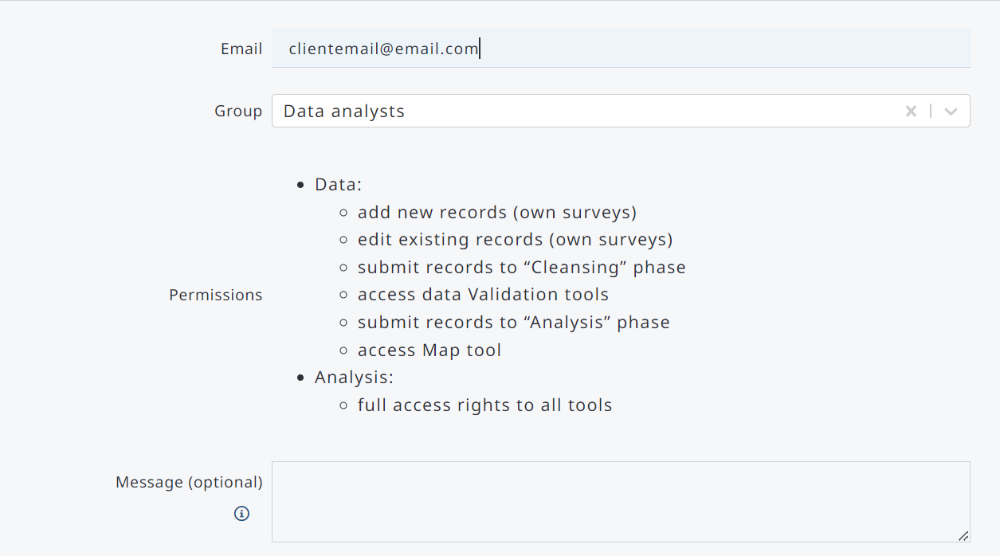

4. Invited users will get an email from Arena granting them access resembling the image below:

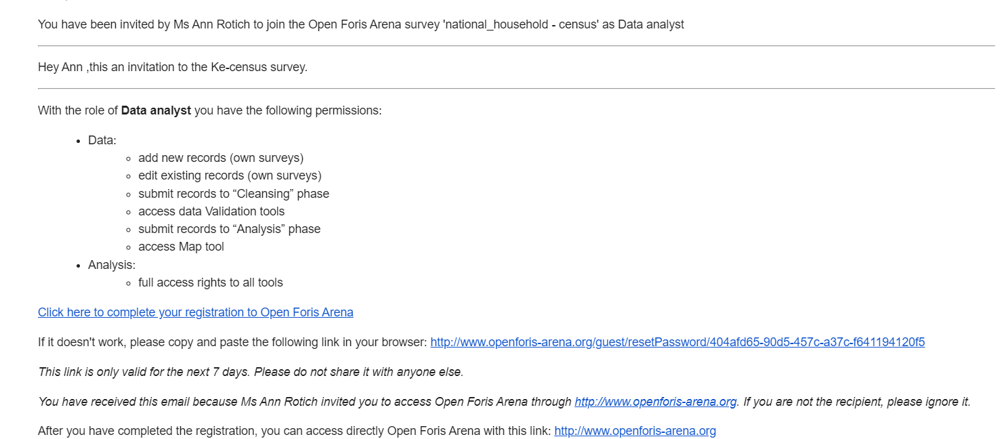

The text of the message is shorter if the invitee (i.e. email) is an already registered Arena user. The email contains links to complete the registration process and subsequently access Arena.

.. tip:: In the case that a recipient does not get an email, the message might be blocked by a strict firewall filter on the recipient’s end.To resolve this, **Ask the recipient to check their spam, junk, and clutter folder for the invitation message.**

5. Once in Arena, login using your email and password. In the case of forgotten password,the recovery process is described in the following section.

Account Management: Passwords
-----------------------------
Changing your password
^^^^^^^^^^^^^^^^^^^^^^
To change your password;

1. Log in to Arena.
2. Go to the **personal settings** located in (“My profile”) at the top-right corner and click on **Change Password**.
3. You need to type your old and new password ensuring it meets the password integrity checks defined by Arena.

.. image:: _static/media/Images/13/13.1/changing_password_verification.png
   :width: 350
   :align: center
   :alt: Changing Password

Resetting your password
^^^^^^^^^^^^^^^^^^^^^^^
To reset your password;

1. Go to the Open Foris Arena login page
2. Click on the **Forgot Password** link
   
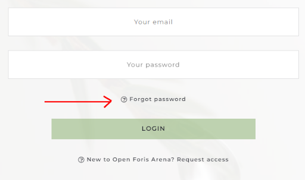

3. Type your login (email) address and click on :guilabel:`Send password reset email`
   
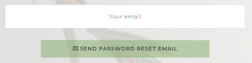

4. The user should get the following message:

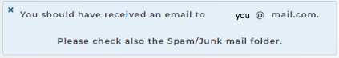

5. The password reset email from Arena looks like this:
   
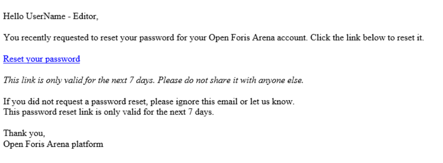

6. Clicking on the reset link on the email should result in this form:

.. image::_static/media/Images/13/13.1/resetting_password_form.png
   :width: 400
   :align: center
   :alt:  Resetting your password

7. After resetting the password,log in to Arena as you would.

**Arena Profile**

Having accessed Arena,new users are recommended to customize their **User Profile; (My Profile)** located on the upper-right side of the screen as a blank icon. 
Here you can set up the following details: Title, Name (i.e., username), Email, and (access) Group. In addition, you can add an image or avatar for your user profile.

Troubleshooting and Problem Resolution
^^^^^^^^^^^^^^^^^^^^^^^^^^^^^^^^^^^^^^
The user support is available via **Open Foris Support Forum** at https://www.openforis.support/
Submit your question following the recommendations provided making sure to include tags:

.. image:: _static/media/Images/1/Support.png
   :width: 700
   :align: center
   :alt: User Support

Alternatively, the **Help** tab on the main menu will provide additional information on the tool.

Typical Working Process
-----------------------
The typical process when working in Arena will be as follows:

1. Login into the platform; 
2. Select a survey;
3. Depending on the user role: view, input, validate, edit, or export data;
4. Data analysis with the help of R scripts  [roles: Survey Administrator, Data Analyst],
5. Viewing and exporting of the results and reports;
6. Logging out from the platform.

ARENA BASIC FEATURES
====================

In this chapter, we'll explore the fundamental features of Arena providing users with a comprehensive understanding of its capabilities. From basic functionalities to advanced options,
this guide will serve as a roadmap for users to navigate through the tool's interface and perform essential tasks efficiently. We will start by exploring the main user interface and all its functionalities.

The Main User interface
-----------------------

Once logged into Arena,you should see the main user interface: On the left panel is the **Home Menu** that lists all the actions and functions available in Arena.These will explained in detail in this part of the documentation.
The dashboard shows your proposed survey with basic and advanced functions to modify it.

.. image:: _static/media/Images/4/Main_Interface.png
   :width: 800
   :align: center
   :alt: Arena Main User Interface

View on the Arena main window depends on your user role (more on this later). With the full access rights, the left side panel contains the following tools.

Home |home|
-----------

**Arena Home** is the entry point for the management of survey properties including deleting surveys,exporting surveys and defining settings for visual assessment.

+-----------------------------------------------------------------------------------------+----------------------------------------------------------------------------------------------------+
| .. image:: _static/media/Images/4/home_icon.PNG       | - Management of survey properties; delete a survey;export a survey; settings for visual assessment |
+-----------------------------------------------------------------------------------------+----------------------------------------------------------------------------------------------------+
| .. image:: _static/media/Images/4/survey_tools.PNG    | - Design or edit data entry forms.                                                                 |
|                                                                                         | - Visual view on survey hierarchy.                                                                 |
|                                                                                         | - Management of categories (i.e., code lists).                                                     |
|                                                                                         | - Management of taxonomic tables (i.e., species lists).                                            |
+-----------------------------------------------------------------------------------------+----------------------------------------------------------------------------------------------------+
| .. image:: _static/media/Images/4/data_tools.PNG      | - Add, view, edit, clone, delete data.                                                             |
|                                                                                         | - Data queries, and access to data cleansing.                                                      |
|                                                                                         | - Map view & data editing; access to Earth Map.                                                    |
|                                                                                         | - Data visualization (under development).                                                          |
|                                                                                         | - Export data into Comma Separated Files (CSV).                                                    |
|                                                                                         | - Import CSV/Collect/Collect Mobile data.                                                          |
|                                                                                         | - Data validation report, and access to data cleansing.                                            |
+-----------------------------------------------------------------------------------------+----------------------------------------------------------------------------------------------------+
| .. image:: _static/media/Images/4/analysis_tools.PNG  | - Create, edit, delete data processing chains,run RStudio.                                         |
|                                                                                         | - Show/stop RStudio (online) server (running process).                                             |
+-----------------------------------------------------------------------------------------+----------------------------------------------------------------------------------------------------+
| .. image:: _static/media/Images/4/users_tools.PNG     | - User management.                                                                                 |
|                                                                                         | - Invitation of new users.                                                                         | 
+-----------------------------------------------------------------------------------------+----------------------------------------------------------------------------------------------------+
| .. image:: _static/media/Images/4/help_tools.PNG      | - Link to this manual .                                                                            |
|                                                                                         | - Arena version number, links to Arena repositories in GitHub.                                     |
|                                                                                         | - Legal Disclaimer.                                                                                |
+-----------------------------------------------------------------------------------------+----------------------------------------------------------------------------------------------------+

User Roles
----------
As described above, every user on the platform has a specific role with predefined access rights related to the survey.

Arena users are divided into the following roles, each of them having the following access rights to  tools, surveys and data.

+-----------------------------------------------------------------------+--------------------------+-------------------+----------------+-------------------+
| Permission                                                            +  Survey Administrator    +  Data Analyst     + Data Cleanser  + Data Editor       |
+--------------+--------------------------------------------------------+--------------------------+-------------------+----------------+-------------------+
|Survey        + Create a new survey                                    +          Survey Manager Status                                                    |                             
+--------------+--------------------------------------------------------+--------------------------+-------------------+----------------+-------------------+
|              + Edit own surveys                                       +         X                +                   +                +                   |
+--------------+--------------------------------------------------------+--------------------------+-------------------+----------------+-------------------+
|              + Delete own surveys                                     +         X                +                   +                +                   |
+--------------+--------------------------------------------------------+--------------------------+-------------------+----------------+-------------------+
|              + View Hierarchy                                         +         X                +          X        +         X      +     X             |
+--------------+--------------------------------------------------------+--------------------------+-------------------+----------------+-------------------+
|              + View categories and taxonomies                         +         X                +          X        +         X      +     X             |
+--------------+--------------------------------------------------------+--------------------------+-------------------+----------------+-------------------+
|              + Export (Arena) schema                                  +         X                +                   +                +                   |
+--------------+--------------------------------------------------------+--------------------------+-------------------+----------------+-------------------+
|              + Export (Arena) schema & data (backup)                  +         X                +                   +                +                   |
+--------------+--------------------------------------------------------+--------------------------+-------------------+----------------+-------------------+
|              + View Collect Import Report (for schema import)         +         X                +                   +                +                   |
+--------------+--------------------------------------------------------+--------------------------+-------------------+----------------+-------------------+
|              + View and export schema summary                         +         X                +         X         +        X       +     X             |
+--------------+--------------------------------------------------------+--------------------------+-------------------+----------------+-------------------+
|Data          + Add new records (own surveys)                          +         X                +         X         +        X       +     X             | 
+--------------+--------------------------------------------------------+--------------------------+-------------------+----------------+-------------------+
|              + Edit all records (own surveys)                         +         X                +         X         +        X       +                   |
+--------------+--------------------------------------------------------+--------------------------+-------------------+----------------+-------------------+
|              + Edit own records (own surveys)                         +         X                +         X         +        X       +     X             |
+--------------+--------------------------------------------------------+--------------------------+-------------------+----------------+-------------------+
|              + Submit record to Cleansing                             +         X                +         X         +        X       +     X             |
+--------------+--------------------------------------------------------+--------------------------+-------------------+----------------+-------------------+
|              + Submit record to Analysis                              +         X                +         X         +         X      +                   |
+--------------+--------------------------------------------------------+--------------------------+-------------------+----------------+-------------------+
|              + Demote/Promote all records                             +         X                +          X        +                +                   |
+--------------+--------------------------------------------------------+--------------------------+-------------------+----------------+-------------------+
|              + Clone Data                                             +         X                +          X        +                +                   |
+--------------+--------------------------------------------------------+--------------------------+-------------------+----------------+-------------------+
|              + Use map                                                +        X                 +          X        +                +                   |
+--------------+--------------------------------------------------------+--------------------------+-------------------+----------------+-------------------+
|              +Export Data to CSV                                      +        X                 +          X        +       X        +  X (own records)  |
+--------------+--------------------------------------------------------+--------------------------+-------------------+----------------+-------------------+
|              + Import (.collect-data)                                 +         X                +         X         +        X       +     X             |
+--------------+--------------------------------------------------------+--------------------------+-------------------+----------------+-------------------+
|              + Validation report                                      +         X                +         X         +        X       +     X             |
+--------------+--------------------------------------------------------+--------------------------+-------------------+----------------+-------------------+
|Analysis      + Acess to analysis tools                                +         X                +         X         +                +                   | 
+--------------+--------------------------------------------------------+--------------------------+-------------------+----------------+-------------------+
|              + View result variables in Explorer and Hierachy views   +         X                +         X         +                +                   |
+--------------+--------------------------------------------------------+--------------------------+-------------------+----------------+-------------------+
|Users         + Acess to analysis tools                                +         X                +                   +                +                   | 
+--------------+--------------------------------------------------------+--------------------------+-------------------+----------------+-------------------+
|              + View result variables in Explorer and Hierachy views   +         X                +                   +                +                   |
+--------------+--------------------------------------------------------+--------------------------+-------------------+----------------+-------------------+

.. note:: If a user is removed from a survey,all their records are assigned to the Survey Administrator.

Selecting and Creating Surveys
------------------------------
Working in Arena,clicking on the expand arrow located besides the Profile Icon in the upper right corner gives access to the following options:

.. image:: _static/media/Images/5/Survey_capabilities.png
   :width: 350
   :align: center
   :alt: Creating Surveys

Clicking on **My Surveys** section shows a table with all the surveys accessible to the user.The list contains the following details:

.. csv-table:: 
   :header: "Header","Explanation"
   :align: center

   "NAME", "Name of the survey that must be at least 6 letters long."
   "LABEL", "Label for the survey."
   "OWNER", "Name of survey administrator (owner)."
   "DATE CREATED", "Date when the survey was created."
   "DATE LAST MODIFIED", "Date when the survey was edited last time."
   "STATUS", "**Draft** -The survey is at the editing stage and contains no data. **Published** -The survey is ready to store data. It can contain input data. **Published-Draft**-The survey is ‘published’, but there are unpublished changes in its structure (i.e., changes in attribute properties, newcalculation scripts or setting)."
   "NODES", "Number of nodes. This indicates the size of the survey."
   "RECORDS", "Number of records in the survey (across all cycles)."
   "CHAINS", "Number of processing chains in the survey."

Creating Surveys
----------------

.. important:: Prior to creating surveys ,let's look at the general guidelines to naming surveys in Arena:

   - The name can only contain lower case letters and underscores.
   - No spaces
   - No special characters ((#%&”?))
   - The entry box will automatically ignore the wrong letters.

The **New Survey** allows a Survey Manager to create a survey in three different ways namely: 

Creating a Survey From Scratch
^^^^^^^^^^^^^^^^^^^^^^^^^^^^^^

To create a new survey from scratch; 

1. Click on **New Survey** that will prompt the survey constructor as shown below.Note that the **New Survey From Scratch** button is highlighted:

.. image:: _static/media/Images/5/survey_from_scratch.png
   :width: 500
   :align: center
   :alt: Creating Survey From Scratch.

2. Arena will prompt you to fill the name,label and choose the default language.
3. Once completed,click on :guilabel:`Create Survey` 
4. Next steps after creating a new survey:
   
- Click on the *Edit Info* and set the Description, needed Spatial Reference System(s) (SRS) and survey languages.The name and label can also be edited here.
- Create the survey structure using the Survey Designer, test your survey and then finally Publish it.

Cloning a Survey from an Existing Survey
^^^^^^^^^^^^^^^^^^^^^^^^^^^^^^^^^^^^^^^^
To clone a survey from an existing one;

1. Click on the **New Survey** and then on the :guilabel:`Clone` button.
2. Fill in a new survey Name and select a survey to be cloned. 

.. note::Cloning will only copy the survey structure, not the data. A cloned survey will always be in the ‘draft’ mode.

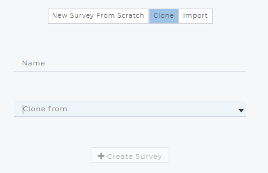

3. After cloning the survey:
   
- Click on the *Edit Info* and set the Description, needed Spatial Reference System(s) (SRS) and survey languages.The name and label can also be edited here.
- Create the survey structure using the Survey Designer, test your survey and then finally Publish it.

Importing a Survey
^^^^^^^^^^^^^^^^^^
In this method,Arena offers two options namely:

- **Importing an Arena survey (.zip)**; An existing Arena survey, such as an Arena backup, can be imported back into Arena (with a new name).
- **Importing an Open Foris Collect survey.**
   
1. As with other methods described above,click on the **New Survey** and then on the :guilabel:`Import` button.
2. Name your survey and define the source of the import.

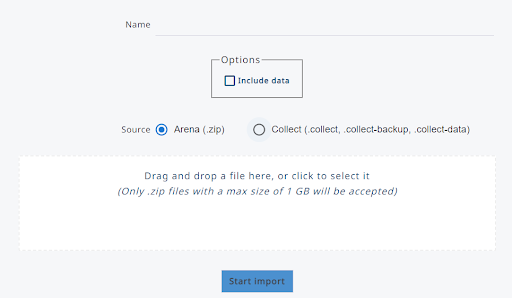

.. important:: Do not use **Export >Import (schema)** for cloning a survey! A published exported survey stays published when imported back into Arena. This means that only a few changes are possible. Instead, if you clone a survey, the new survey will be in the draft mode, and you can for example change/edit a taxonomic list. 

3. Next steps after importing the survey: 
   
- Go into *Edit Info* and edit survey properties if needed.
- If the survey structure needs changes, use the Survey Designer, test your survey and then Publish it.

.. note:: In the case ,where a user wants to import an **Open Foris Collect Survey**, this can be done using the *.collect*, *.collect-data*  or *.collect-backup* files.After importing, you should view the Collect Import Report at the Home section. In addition, check out that all forms, tables, attributes and their properties are imported correctly.

Follow these steps after importing a Collect survey: 

- Go into Home *Edit Info* and edit survey properties as needed.
- Use the Survey Designer to modify the user-interface (as location and size of text boxes etc.).
- Go into Home - Collect Import Report, and fix the remaining (unresolved) issues.[3] 
- Test your survey in Arena and then finally Publish it.

ARENA MODULES
=============

Now that you have been familiarized to the interface including  workflows,functionalities and tools,we will now delve into the Arena modules.This section serves as the cornerstone of our documentation, encompassing the primary tools and modules that form the backbone of our software.
Users will gain insight into the core functionalities, including but not limited to data manipulation, analysis, visualization, and integration capabilities.By exploring each tool and module in detail, users will be equipped with the knowledge necessary to leverage our software effectively for their surveys.

ARENA HOME
==========
The Home page contains all the necessary functionalities to manage survey properties including the editing, publishing,exporting and optimization of visual survey settings.

Located on the top of Arena's main interface,Arena Home hosts the following functions:

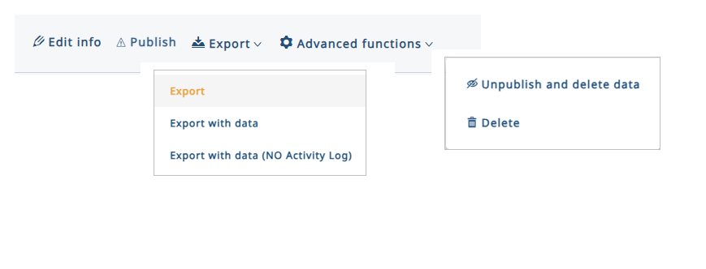

Edit-Info
---------
Edit-Info can be accessed by either clicking on the :guilabel:`Edit Info` icon or by clicking the survey name. 

Edit-Info allows the editing of the survey's metadata-where metadata refers to the descriptive information of the survey on its content,structure and administration.

.. image:: _static/media/Images/6/edit_info_results.png
   :width: 700
   :align: center
   :alt:  Edit-Info

The following properties can be edited here:

1. **Name**:  The name of the survey in the database. 
              Only the Survey Administrator can rename the survey .
2. **Labels**:  The survey's label- a clear name for the survey.
                Clicking on the expand icons will allow viewing/editing labels with other selected languages.
3. **Descriptions**: Additional information about the survey (optional).
4. **Languages**: Survey language(s). **If more than one language is added, then labels need to be given by all selected languages.**
5. **SRS** : Spatial Reference Systems applied in the survey.
             Add here all SRSs which will be needed in the data collection. 

.. hint:: SRS are necessary when users have spatial attributes that may need to be visualized on a map. To add a new SRS, click the cursor into the input box and to see the options, type in some letters of the EPSG code.

6. **Cycles**: Inventory cycle(s) and timing(s). 

.. Note:: Times in cycles cannot overlap.For example this data cycle is accepted:

   .. image:: _static/media/Images/6/cycles.png
      :width: 600
      :alt: Cycles

7. **Cycle for Arena Mobile**: The cycle for uploading a survey into Arena Mobile in a multicycle survey case.
8. **Sample-based image interpretation**: Sets parameters for visually collected data i.e from map or satellite image. More on this can be found in this :ref:`chapter<map>`

Publishing Surveys
------------------
A draft survey needs to be published in order to make all new changes available for the users. These changes may be in the form of changes in attributes’ properties (as new validation rules), changes in form layout, new read-only attributes or new calculation scripts.

Publishing a survey will make the following changes to the survey:

- It will be available for data entry in the RECORDS section.
- Changes applied to the survey will be visible even in data entry.
- Deleted node definitions (e.g. attributes) will be permanently deleted from the records.
- Modified validation rules will be evaluated again and records re-validated (only for changed/edited records).
- For surveys imported from Collect: record editing will be available.

When publishing a survey,Arena will display the folloing warning:

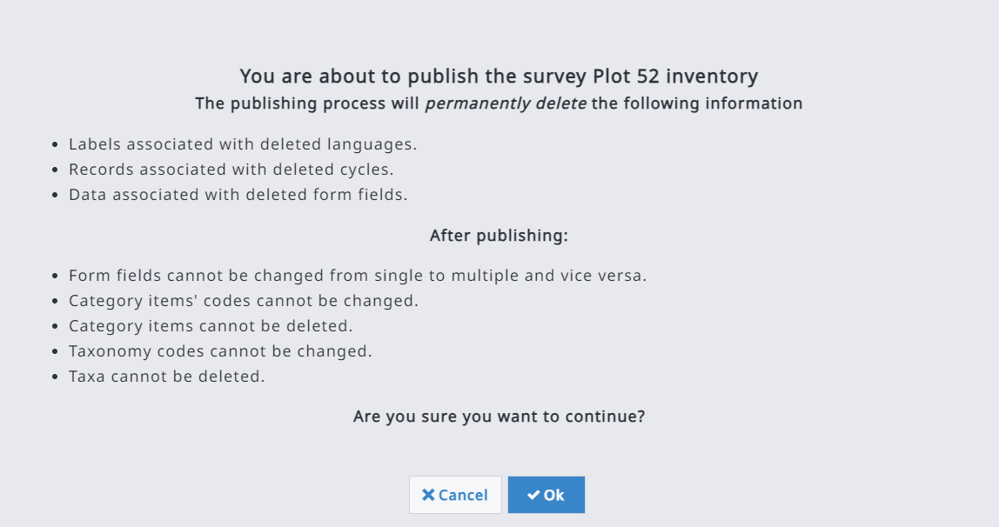

If publishing fails;

1. Open the **Details** section.
2. Scroll into the end of the error list.
3. Click on **EXPORT** to get the error list as a CSV file (arena_NodeDefsValidationJob_errors.csv) as shown here:
   

.. image:: _static/media/Images/6/survey_publish_errors.png
   :width: 400
   :align: center
   :alt: Publishing Error
   

4. Fix all the issues in the survey and re-publish your survey.

Exporting Surveys and Data Backup
---------------------------------
The survey can be exported into a :code:`.zip` file with or without the data. 

In this way the user can create and download a backup file. The zip file contains the following content depending on the selected option:

.. image:: _static/media/Images/6/export.png
   :width: 600
   :align: center
   :alt: Exporting options

Activity log contains the history of a survey. For example, it can contain data about who and when a certain record attribute was updated with a new value, or who and when a record was upgraded from Cleansing level to Analysis. 
It is typically faster to export a survey **without** the activity log.

Unpublishing or Deleting a Survey
---------------------------------
Under the **Advanced Functions**,there are functionalities to unpublish a survey or delete it entirely.

.. Note:: Only a Survey Administrator can unpublish or delete a survey. Unpublishing removes all data from the survey, but keeps its structure.Deleting on the other hand removes both data and the survey structure from the database. 

To delete a survey, you need to confirm the deletion by typing in the survey name.

.. image:: _static/media/Images/6/deleting_survey.png
   :width: 500
   :align: center
   :alt: Deleting Survey

After deleting a survey, you have no active survey selected. This means that most commands will be inactivated. If you go to the **HOME** section, you will see the next text on the screen:

.. image:: _static/media/Images/6/home_after_delete.png
   :width: 500
   :align: center
   :alt: Deleting Survey

In order to continue working with Arena, you either need to select a survey or start creating a new one.

Collect Import Report
---------------------
If a survey was imported from an :code:`Open Foris Collect`  file, it gets a **Collect Import Report**. Otherwise, this option is not visible for all surveys.

The main difference between Arena and Collect is that **Arena uses JavaScript (JS) language in expressions, while OF Collect uses XPath language** (for example within Required and Validation rules). So, when a Collect survey is imported, all expressions need to be converted from XPath into JS, either programmatically or by typing them in manually.

After importing a Collect survey into Arena, the Collect Import Report table shows all expressions which need special attention, such as possible modifications. The import process can convert the most typical XPath expressions into JS, but not complex expressions. Therefore it is really essential to fix all remaining issues before trying to publish an imported survey.

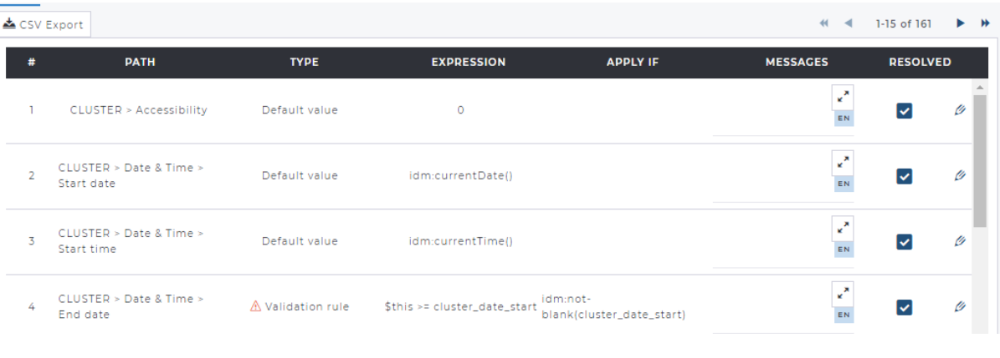

The report table contains the following fields:

- **PATH** : The path of entity/attribute in the survey structure.
- **TYPE** : The expression type (Default value, Validation rule, Relevant if).
- **APPLY IF** : XPath APPLY IF expression in OF Collect.
- **MESSAGES** : Validation rule’s user-tailored message in OF Collect. Clicking on the expand arrows will allow viewing and editing messages with other selected langages.
- **RESOLVED** : If the :guilabel:`⬜` is unchecked,the import process did not do the conversion. Check all unsolved issues before publishing your survey ! Mark the issue solved(manually) after resolving issues.
               :guilabel:`☑️` checked tick shows that the issue is solved.

               :guilabel:`✎` Edits the table,form or attribute properties.

The report table can be exported into a :code:`.CSV` file by clicking the :guilabel:`CSV Export` button. This is probably the best way to examine what needs to be fixed in the survey. In this table, the value ‘1’  in the column ‘Resolved’ indicates resolved cases, and those with blanks are not converted in the importing process.

.. important:: A Collect survey can contain a validation rule which is logically incorrect but still working (!).A value is checked against an attribute that is given later in the form/table. An example: in Collect, the XPath validation expression is given for “Mechantable” (height) as follows:

   *tree_height and (tree_height_measure_type="2" or tree_height_measure_type="3")* 

In this case, the Collect Import Report shows this as an unresolved issue. The reason is that in this survey “tree_height (Height [m])” is after “Mechantable”, as seen below in the table. Arena cannot handle a validation expression with an attribute being second in the hierarchy

.. image:: _static/media/Images/6/validation_rule_example_table.png
   :width: 500
   :align: center
   :alt: Validation rules for Collect Surveys

The second typical issue with a Collect survey is that it may not require additional setting in the key fields for multiple-entry entities. In Arena, all multiple-entry entities must have a key (or keys).

Working with Cycles
-------------------
Arena can host multi cycle-data. By default, all new surveys contain ‘Cycle 1’. Only the Survey Administrator or System Administrator can add, edit or delete cycles in the *Home/Survey Info* section. **Every survey needs to have at least one cycle.**

After adding, editing or deleting a cycle, the survey should be published in order to make the changes effective. Deleting a cycle will permanently remove all the records of the cycle!

When a new cycle is added, it inherits the survey structure (i.e. schema) from the previous cycle. However, data structure between the cycles can contain differences, so each cycle can have its individual properties such as different attributes, form layout, etc. 

If the survey contains more than one cycle, an attribute (with a specific name) can belong to one specific cycle, or to preset cycle(s). Attribute’s properties (e.g. name, label, validation rules) are same across the cycles, but an attribute’s position on the forms may vary.

More about cycles:

- Each cycle contains its own records. A record cannot be common across cycles.
- Settings for the “sample-based image interpretation” are common across cycles.
- Categories and taxonomies are common across cycles.
- The Validation Report is executed only for the selected cycle’s data.
- “Survey Export with Data” will export data from all cycles.
- “Data Export” into CSV files will export data from the selected cycle. In every table, the first column indicates the cycle number.
- “Data Import” will import data only into the selected cycle.
- Within a published survey, records can be cloned from a cycle to a newer cycle (read more in Cloning data).
- Data Analysis (with Studio) will retrieve data only from the selected cycle.

SURVEY
======
The Survey section contains the following tools:

1. **Form Designer**: tools  for creating new data entry forms, creating and editing of tables/forms and attributes and all their properties, and to design the visual outlook of the forms. 
2. **Hierarchy**: Shows the survey's hierarchy, entities and attributes.
3. **Categories**: Management of categorical data (i.e. code lists).
4. **Taxonomies**: Management of taxonomic data (i.e. species lists)

Survey Terminologies
--------------------
Before we delve into the survey section,let's look at some important terminologies associated with surveys:

- **Entity**: Data entities are the objects of the data model such as ‘plot’ or ‘tree’. These are shown in Arena as forms or tables. Entities are containers for attributes and relationships between objects.  
- **Attribute**: A data attribute is a unit of information inside a data entity, i.e. it is a single-value descriptor for a data object. These are like properties of data entities: for example, an entity ‘tree’ can contain the following attributes: species, diameter, and age.
- **Node** (object):A node is a basic unit of a data structure.In Arena,the data structure has the shape of a tree. A node object is represented by a single node in a tree, and it can be an element node, attribute node, text node, or any "node type". `Read more on nodes <https://en.wikipedia.org/wiki/Node_(computer_science)>`_

The figure below is a visual representation of a survey:

.. image:: _static/media/Images/7/7.1/survey_visual.png
   :width: 400
   :align: center
   :alt: Survey structure

Form Designer
-------------
The form designer is a tool available to Survey Administators to design the content and outlook of a survey and resultantly create a user-friendly interface for data management.

.. image:: _static/media/Images/7/7.2/form_designer_interface.png
   :width: 400
   :align: center
   :alt: Form Designer Interface

The form designer allows for the following functionalities:

+------------------------------+------------------------------------------------------------------------------------------+----------------------------------------------------------------------------------+
| Method                       |   Icon                                                                                   |    Explanation                                                                   |
+==============================+==========================================================================================+==================================================================================+
| Add a new subpage            + .. image:: _static/media/Images/7/7.2/subpage_icon.png + Add a new entity (table/form)                                                    |
+------------------------------+------------------------------------------------------------------------------------------+----------------------------------------------------------------------------------+
| Define the number of columns + .. image:: _static/media/Images/7/7.2/columns_icon.png + The default number of columns is 3, this can be changed [1 - 12]                 |
+------------------------------+------------------------------------------------------------------------------------------+----------------------------------------------------------------------------------+
| Add a new object             + .. image:: _static/media/Images/7/7.2/add_object.PNG   +  add a new entity or attribute                                                   |
+------------------------------+------------------------------------------------------------------------------------------+----------------------------------------------------------------------------------+
| Delete an object             + .. image:: _static/media/Images/7/7.2/delete_object.PNG+  deletes an entity or attribute                                                  |
+------------------------------+------------------------------------------------------------------------------------------+----------------------------------------------------------------------------------+
| Rename an object             + .. image:: _static/media/Images/7/7.2/rename_object.PNG+ change name of attribute (except for published surveys )                         |
+------------------------------+------------------------------------------------------------------------------------------+----------------------------------------------------------------------------------+ 
| Resize an object             + .. image:: _static/media/Images/7/7.2/resize_icon.PNG  + Move the cursor to the lower right corner of the object, and then drag to resize |
+------------------------------+------------------------------------------------------------------------------------------+----------------------------------------------------------------------------------+
| Change order of attributes   +                                                                                          + Drag to an object and drop it to a new place in the forms                        |
+------------------------------+------------------------------------------------------------------------------------------+----------------------------------------------------------------------------------+
| Preview the survey           + .. image:: _static/media/Images/7/7.2/preview_icon.png + Previews a survey                                                                |
+------------------------------+------------------------------------------------------------------------------------------+----------------------------------------------------------------------------------+
| Move up/down                 + .. image:: _static/media/Images/7/7.2/move_icon.png    + Moves a selected node up or down                                                 |
+------------------------------+------------------------------------------------------------------------------------------+----------------------------------------------------------------------------------+
| Add/Edit objects' properties + .. image:: _static/media/Images/7/7.2/edit_object.PNG  + Adds/changes all properties e.g. labels,default values,validation rules          |
+------------------------------+------------------------------------------------------------------------------------------+----------------------------------------------------------------------------------+

Data Types
----------
The properties of an entity (table/form) or an attribute describe the characteristics and behavior of data added to that object. The data type is an example of one such property.

The data type is the most important property because it determines what kind of data the field can store. Arena supports the most common data types applied in database management systems, and two composite data types: coordinates and taxonomic data. 

The data attribute types accepted in Arena are presented in the following table:

+------------------------------+------------------------------------------------------------------------------------------+----------------------------------------------------------------------------------------------------+
| Data Type                    |   Icon                                                                                   |             Notes                                                                                  |
+==============================+==========================================================================================+====================================================================================================+
| Boolean                      + .. image:: _static/media/Images/7/7.2/boolean_icon.png + True/false ;yes/no                                                                                 |
+------------------------------+------------------------------------------------------------------------------------------+----------------------------------------------------------------------------------------------------+
| Code                         + .. image:: _static/media/Images/7/7.2/code_icon.png    + Refers to categorical variables ie code lists. Will be explained further in the Categories Chapter |
+------------------------------+------------------------------------------------------------------------------------------+----------------------------------------------------------------------------------------------------+
| Coordinate                   + .. image:: _static/media/Images/7/7.2/coordinate.png   + Enters  geographical coordinates.                                                                  |
|                              +                                                                                          + Optional properties: accuracy, altitude, altitude accuracy                                         |
+------------------------------+------------------------------------------------------------------------------------------+----------------------------------------------------------------------------------------------------+
| Date                         + .. image:: _static/media/Images/7/7.2/date_icon.png    + Entered in dd/mm/yyyy format                                                                       |
+------------------------------+------------------------------------------------------------------------------------------+----------------------------------------------------------------------------------------------------+
| Time                         + .. image:: _static/media/Images/7/7.2/time_icon.png    + Entered in HH:MM format                                                                            |
+------------------------------+------------------------------------------------------------------------------------------+----------------------------------------------------------------------------------------------------+ 
| File                         + .. image:: _static/media/Images/7/7.2/file_icon.png    + Allows upload of files(photo,audio,video,documents)                                                |
+------------------------------+------------------------------------------------------------------------------------------+----------------------------------------------------------------------------------------------------+
| Integer                      + .. image:: _static/media/Images/7/7.2/integer_icon.png + Numbers with no decimal digits                                                                     |
+------------------------------+------------------------------------------------------------------------------------------+----------------------------------------------------------------------------------------------------+
| Numeric                      + .. image:: _static/media/Images/7/7.2/numeric_icon.png + Numbers with decimal digits .Default number of decimals (6 digits)                                 |
+------------------------------+------------------------------------------------------------------------------------------+----------------------------------------------------------------------------------------------------+
| Taxon                        + .. image:: _static/media/Images/7/7.2/taxon_icon.png   + Read more at Taxonomies                                                                            |
+------------------------------+------------------------------------------------------------------------------------------+----------------------------------------------------------------------------------------------------+
| Text                         + .. image:: _static/media/Images/7/7.2/text_icon.png    + Allows to add free text                                                                            |
+------------------------------+------------------------------------------------------------------------------------------+----------------------------------------------------------------------------------------------------+
 
.. important::
   - Conversion between the data types is not possible. If you need to change a variable (attribute) from Integer to Numeric, then you need to create a new variable and delete the old one. However, it is not recommended to delete a variable if the survey is published and it contains data.   
  
   - When naming attributes, do not use the suffix “_label”! If for example you have a coded attribute cluster_district in the survey, there will (automatically) also be a field cluster_district_label in the database. If there is this type of conflict, this will be shown only when trying to publish the survey.
   
   - Arena does not contain a data type “range” as applied in OF Collect. When a survey is imported from OF Collect, “range” type attributes are converted into two integer attributes: attributename_from and attributename_to.

.. _template:

TEMPLATES
=========
Templates are pre-designed tested surveys which can be adapted fit to specific purposes, for example collecting forest inventory or socio-economic data collecting.Templates offer an easy way to start the survey design process.

In Arena;

- Only a Survey Manager can clone a template
- The idea using the templates is that it is easier to delete tables, forms and attributes than create them. Therefore there are more entities and attributes in these templates than needed!
- Survey labels are already stored with multiple languages. All labels can be edited as needed, and new language(s) can be added.

There are several templates available in Arena.Please see :ref:`annex4` for screenshots of these templates.

+------------------------------+------------------------------------------------------------------------------------------+----------------------------------------------------------------------------------------------------+
| Template                     |   Purpose                                                                                |             Languages                                                                              |
+==============================+==========================================================================================+====================================================================================================+
| Template_Forest_Inventory_B  |Typical forest attributes for a forest inventory case.                                    | English                                                                                            |
|                              |This is a template with the following structure:                                          | Spanish                                                                                            |
|                              |cluster (or tract/transect)-plot-child entities (several)                                 | French                                                                                             |
|                              |'stratum' can be a property of 'cluster' or 'plot'                                        |                                                                                                    |
|                              |'canopy_cover' is an  assessment at the 'plot' level                                      |                                                                                                    |
+------------------------------+------------------------------------------------------------------------------------------+----------------------------------------------------------------------------------------------------+
| Template_Forest_Inventory_C  |Typical forest attributes for a forest inventory case.                                    | English                                                                                            |
|                              |This is a template with the following structure:                                          | Spanish                                                                                            |
|                              |cluster (or tract/transect)-plot-subplot (or stand/section)-child entities (several)      | French                                                                                             |
|                              |'stratum' can be a property of 'cluster' or 'plot'                                        |                                                                                                    |
|                              |                                                                                          |                                                                                                    |
+------------------------------+------------------------------------------------------------------------------------------+----------------------------------------------------------------------------------------------------+
| Template_Forest_Inventory_D  |Typical forest attributes for a forest inventory case.                                    | English                                                                                            |
|                              |Template with the following structure:                                                    | Spanish                                                                                            |
|                              |plot-subplot (or stand/section)-child entities (several)                                  | French                                                                                             |
|                              |'stratum' can be a property of 'cluster' or 'plot'                                        |                                                                                                    |
|                              |'canopy_cover' is under'plot' level                                                       |                                                                                                    |
+------------------------------+------------------------------------------------------------------------------------------+----------------------------------------------------------------------------------------------------+
|Template_Forest_Inventory_E   |Typical forest attributes for a forest inventory case.                                    | English                                                                                            |
|                              |This is a template with the following structure:                                          | Spanish                                                                                            |
|                              |plot-child entities(several)                                                              | French                                                                                             |
|                              |                                                                                          |                                                                                                    |
|                              |                                                                                          |                                                                                                    |
+------------------------------+------------------------------------------------------------------------------------------+----------------------------------------------------------------------------------------------------+
| Template_Community_Survey    |FAO Forestry Paper 179 “National Socioeconomic Surveys in Forestry”.                      | English                                                                                            |
|                              |Community Handbooks:                                                                      | Spanish                                                                                            |
|                              |- EN : https://www.fao.org/3/i6206e/i6206e.pdf                                            | French                                                                                             |
|                              |- FR : https://www.fao.org/publications/card/en/c/I6206FR/                                |                                                                                                    |
|                              |- ES : https://www.fao.org/publications/card/es/c/I6206ES/                                |                                                                                                    |
|                              |- EN forms: https://www.fao.org/forestry/forestry-modules/en/                             |                                                                                                    |
+------------------------------+------------------------------------------------------------------------------------------+----------------------------------------------------------------------------------------------------+
|Template_Household_Survey     |As above                                                                                  | English                                                                                            |
|                              |Household survey                                                                          | Spanish                                                                                            |
|                              |                                                                                          | French                                                                                             |
|                              |                                                                                          |                                                                                                    |
+------------------------------+------------------------------------------------------------------------------------------+----------------------------------------------------------------------------------------------------+
|Template_Village_Survey       |Village Survey COMING SOON                                                                | English                                                                                            |
|                              |                                                                                          | Spanish                                                                                            |
|                              |                                                                                          | French                                                                                             |
|                              |                                                                                          |                                                                                                    |
+------------------------------+------------------------------------------------------------------------------------------+----------------------------------------------------------------------------------------------------+

.. Note:: More templates will be frequently added by FAO.

Using a Template
----------------
When using a template to create a new survey,follow these steps:

1. Go to **New Survey** at the upper-right corner, select **Clone** and a Template can be selected from the **Clone From** list, as follows:

.. image:: _static/media/Images/8/8.1/template_cloning.png
   :width: 400
   :align: center
   :alt: Cloning a template

2. Give a new name to your survey, and click the :guilabel:`Create Survey` button.
3. Select :guilabel:`Edit Info` and edit survey properties. You can still change the survey name here.You can also delete all unneeded languages, and add the required spatial reference systems into the survey.
4. Go into the Form Designer, and edit the survey as needed. You can delete the unneeded entities (tables/forms) and attributes, and add new ones into the pages. In templates, there are typically more entities and attributes than needed, because it is faster to delete the extra ones than to add new attributes. 
5. Test your survey with Preview.
6. When ready, Publish the survey.
7. Go to the **USERS** (in the home tab) and invite users to get access to your survey (as explained earlier).

Getting a New Template into Arena
---------------------------------
Currently, only a FAO System Administrator can add new templates into Arena. If you are a Survey Administrator, and you want to offer a new template into Arena or improve an existing one, please contact the Arena development team by email at *openforisinitiative@gmail.com* writing into the Topic field: **“Suggested survey to Arena template”**

A template can be a published and tested survey, and it should be generic for a certain data collection purpose. As stated before, a good template can contain more attributes than needed, because it will be easier and faster for other Survey Administrators to delete the extra (unneeded) ones than to add new attributes in the Form Designer.

DATA
====
Data Processing Stages
----------------------
Arena implements a workflow which divides data processing into three steps (or stages) namely:

1.  Data entry.
2.  Data cleansing.
3.  Data analysis.

.. image:: _static/media/Images/9/9.1/data_entry_workflow.png
   :width: 600
   :align: center
   :alt: Data Entry Workflow

Data Entry
----------
Data is entered into Arena exactly as they appear on paper field forms:

- They are neither interpreted nor corrected during this phase. 
- Invalid values (those marked as “error”) must be checked against the field forms. If the value was copied correctly, the value should be manually accepted. If it was copied incorrectly, the value should be entered as it appears on the field forms.
- Once all errors are either resolved or confirmed, the data entry clerk submits the record for data cleansing.  Before entering the cleansing phase, a copy is made and marked read-only.
- No further changes may be made to this record by data entry staff (unless the record is returned by data cleansing staff).

Data Cleansing
--------------
Once in Arena,experts with knowledge of field conditions and data, work with a copy of the data entered in step 1 to correct or remove invalid values. 

.. Note:: “Data entry” level users cannot not edit the data which is at the cleansing stage.
   
If the data cleansing expert deems that the data entry task was not completed or that the record contains too many errors, the record may be returned to phase 1 (entry) for additional changes.

Once all data errors are resolved, the record may then be submitted for data analysis.  This locks the record so that no further changes may be made.

Data Analysis
-------------
In this stage: Records are locked and thus ready for analysis. They can be viewed, but not edited.

If during analysis data are deemed incomplete or incorrect, the record may be rejected and sent back for further cleansing. Once updated and resubmitted, the record may once again be available for calculation and analysis.

In the Data/Records view, selected records can also be promoted or demoted, as follows:

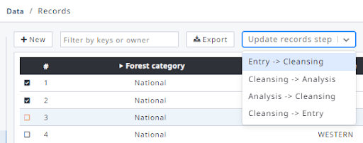

Adding, Editing and Viewing Records
-----------------------------------

The Records section allows users to enter, edit, view or delete data. 

The main entry view for the Records section contains a list of all entries (at the root level) shown with some metadata: value(s) of key field(s) namely ; Date when created, Date when modified, Owner, Step, number of Errors, and number of warnings as shown below;

.. image:: _static/media/Images/9/9.2/records_section_view.png
   :width: 600
   :align: center
   :alt: Records Section View

The data processing stages are coded as follows: 
1: Data entry stage, 2: Data validation stage, 3: Data analysis stage.

The following command buttons are available:

+------------------------------+------------------------------------------------------------------------------------------+
|Command Button                |   Icon                                                                                   |                                                                                              
+==============================+==========================================================================================+
| Edit                         + .. image:: _static/media/Images/9/9.2/edit_icon.png    |                                                                                 
+------------------------------+------------------------------------------------------------------------------------------+
| Delete                       + .. image:: _static/media/Images/9/9.2/delete_icon.png  |
+------------------------------+------------------------------------------------------------------------------------------+
| View Locked Records          + .. image:: _static/media/Images/9/9.2/lockdrecord.png  |
|                              +                                                                                          |
+------------------------------+------------------------------------------------------------------------------------------+
| Sorting/Odering Records      + .. image:: _static/media/Images/9/9.2/sorted_recds.png |
+------------------------------+------------------------------------------------------------------------------------------+

The user interface offers an input box for filtering the records, as follows:

.. image:: _static/media/Images/9/9.2/records_filter_inputbox.png
   :width: 350
   :align: center
   :alt: Filtering Records

The list of records can be exported into a CSV file by clicking on the :guilabel:`Export List` button.

Inputting data is straightforward. You will see all tables/forms at the left side panel, and data entry form in the main window at the right side. Always start by entering data at the highest hierarchical level. For example, if you want to save forest inventory data where the structure is *“cluster-plot-tree”*, input the cluster level data first, then the plot level etc. This guarantees the consistency of the stored data. 

Remember Arena does not lock the records (at data entry stages 1 and 2) thus users can work with the same data set and edit the same record simultaneously.  All records are locked only when data is submitted to stage 3 (Data Analysis).

Start adding a new records by clicking the :guilabel:`+ New`  button. The program will open a data entry form. While entering the data, all data are automatically written into the database, i.e. **there is no ADD-button!**

.. image:: _static/media/Images/9/9.2/data_entry_form.png
   :width: 500
   :align: center
   :alt: Adding New Records

All items that are set as “required” are marked with :guilabel:`⚠` as long the input field stays blank. The red label text and the red symbol can also indicate that there can be an error in the data item.

.. image:: _static/media/Images/9/9.2/required_value_warning.png
   :width: 400
   :align: center
   :alt: Error Message

In case of a multiple-entry table/form, such as tree data, the new record can be added by clicking the :guilabel:`+`  button next to the table/form’s name.

.. image:: _static/media/Images/9/9.2/record_in_multientry_table.png
   :width: 550
   :align: center
   :alt: Multi-Entry Table

Arena offers two options how to see the entities and attribute identifiers: 

- :guilabel:`Show Names`: entity (table/form) or attribute name is shown.
- :guilabel:`Show Labels`: entity or attribute label is shown.

When working with forms that belong to **lower level entities**, there is a text in the upper left corner showing the position of the record in the survey hierarchy, as follows:

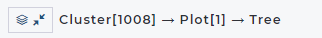

When working with **species data**,start typing the first letters of the species name, or a code. A dropdown menu will emerge and you can pick up the correct name as shown in the next image; 

.. image:: _static/media/Images/9/9.2/adding_species_specification.png
   :width: 500
   :align: center
   :alt: Working with species

There are two species names automatically added by the system: Unknown (UNK) and Unlisted (UNL). To enter one of these, type ‘un’ into the species name input box.

.. image:: _static/media/Images/9/9.2/unknown_species.PNG
   :width: 450
   :align: center
   :alt: Unknown species.

In some cases, the attribute data type is **‘file’**, the user interface looks as follows:

This is an upload button that can be used to upload a file into the Arena database.

.. image:: _static/media/Images/9/9.2/unknown_species.PNG
   :width: 500
   :align: center
   :alt: Working with file attributes

Once a file has been uploaded, Arena shows the file name : When hovering over the name, a small snapshot view becomes visible.Clicking the file name can download it into the user's local machine.

.. image:: _static/media/Images/9/9.2/upload_button.png
   :width: 500
   :align: center
   :alt: Working with file attributes

Deleting Records
----------------
To delete records in Arena;

1. Click on the **Records section** and view the list of records. 
2. You can select one or more records and delete them by clicking the :guilabel:`🗑`  icon.
3. Always look at the step of your record before initiating deletion: 

.. image:: _static/media/Images/9/9.3/records_list.png
   :width: 500
   :align: center
   :alt: Deleting Records

As explained earlier, you can only delete a record that is on the *Entry or Cleansing stage*. 

.. image:: _static/media/Images/9/9.3/deleting_step.png
   :width: 300
   :align: center
   :alt: Deleting Records

4. Clicking on the :guilabel:`🗑` button, the following message box will appear;
   
.. image:: _static/media/Images/9/9.3/deleting_warning.png
   :width: 300
   :align: center
   :alt: Deleting Message

Deleting Table Rows
-------------------
In addition to deleting individual records ,Arena has capabilities to delete entire rows.

To delete rows;

1. Browse to the last column of a row. 
2. Clicking on the :guilabel:`🗑`  will display the following message box :
   
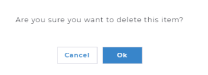
 

3.Click **OK** if you are sure. **But be aware: there is no UNDO function in the system!**

Cloning Data
------------

Apart from cloning the survey's structure,Arena also has provisions for cloning data. 

In the case of a multi-cycle survey, a Data Analyst (or a user with a higher role) can clone records from one cycle to another. The following conditions apply:

-	The survey should contain more than 1 cycle.
-	The survey must be published.
-	Only data from older cycles can be cloned to newer, i.e. from Cycle 1 to 2, or from Cycle 2 to 3, but not vice versa.
-	Records cannot be overwritten in the target cycle; already existing records are skipped.
-	Record key attribute definitions (defined in the Form Designer), must be the same in source and target cycle; if they have been modified, cloning won't work;
-	The Clone-button is not shown for the last cycle’s record list;

To clone data,we follow the following steps;

1. Select the source cycle, e.g. Cycle 2.
2. Select the records to be cloned.

.. image:: _static/media/Images/9/9.4/cloning_records.png
   :width: 200
   :align: center
   :alt: Cloning data

In the instance where you want to clone all records, you do not need to make any selection.

3. Click on :guilabel:`Clone` 
4. Select the target cycle,
5. Select whether you want to clone all records or only the selected ones:
   
.. image:: _static/media/Images/9/9.4/cloning_warning.png
   :width: 300
   :align: center
   :alt: Cloning Data   

6. Click on :guilabel:`Start Cloning` to initiate the cloning. 

Data Explorer and Data Aggregation.
-----------------------------------
Data Explorer is a tool for viewing data in tabular format. You can view both input data and (computed) result variables in the same table in multiple ways (such as filtered and/or sorted). Moreover,data can be exported from this view into a :code:`csv` file. 

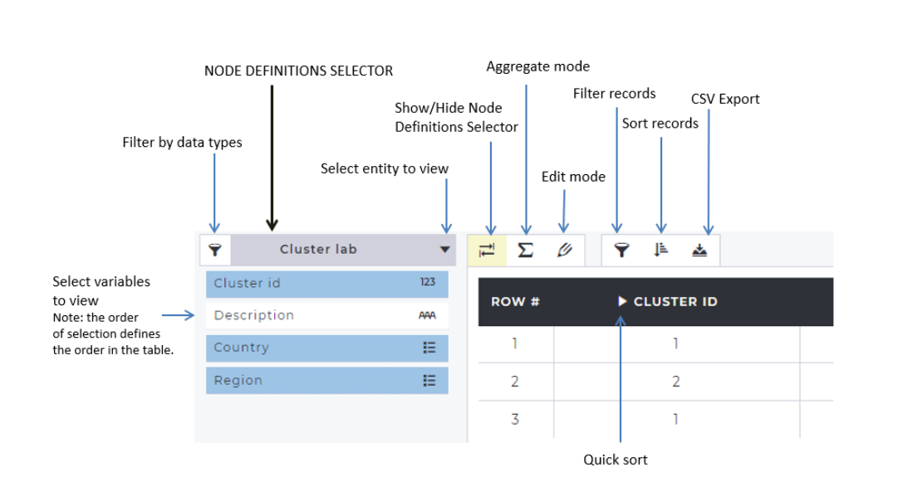

When the letter :guilabel:`M` is labelled on any of the variables in the Cluster lab,this indicates that this is a multiple-entry attribute.

In the EDIT mode, data variables (both input and computed data ) can be selected as well as edited as seen below:

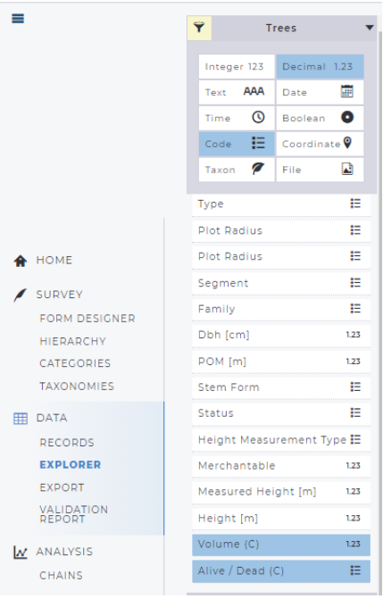

In addition to its viewing capabilities,the Data Explorer can also be used to aggregate data : this means that it can work as a reporting tool in the “Aggregate Mode”. 

Data can be aggregated to higher levels of the hierarchy. The :code:`Σ` mode contains these two sections:

1. Dimension :All categorical attributes and key attributes of the selected entity and its parent entities. The list also contains computed categorical variables and these are tagged with **(C)**
2. Measure:  All numeric attributes of the selected entity and its parent entities, but **excluding key attributes.** The list also contains computed quantitative (i.e. numeric) result variables and these are tagged with (C).

Multiple-entry attributes,however, cannot be shown in the aggregate mode view. For example, tree result variables, such as “number of trees per hectare” can be aggregated to a plot level, or any upper level.  

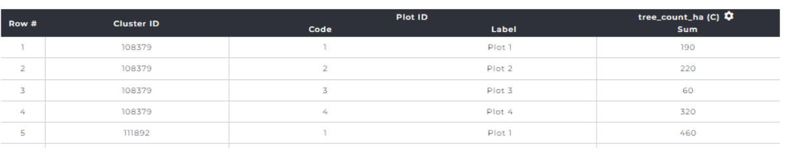

To see the aggregates;

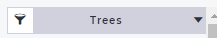

1. Select your table/form to report measures |reportmeasures|
2. Click on the :guilabel:`Σ` button.It should turn yellow.
3. Select the Dimensions to be reported. In this case **Cluster ID** and **Plot ID** are selected:

.. image:: _static/media/Images/9/9.5/reporting_dimensions.png
   :width: 400
   :align: center
   :alt: Data Aggregation

4. Select the Measures to be reported:

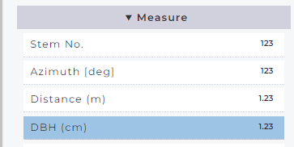

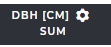

5. In the table view, SUM is the default function. To change this, we can click |function| at the :guilabel:`⚙️` and change the aggregate function as shown below:
   

.. image:: _static/media/Images/9/9.5/changing_aggregate_example.png
   :width: 450
   :align: center
   :alt: Data Aggregation.

6. Deselect SUM, and select COUNT and AVERAGE.
   
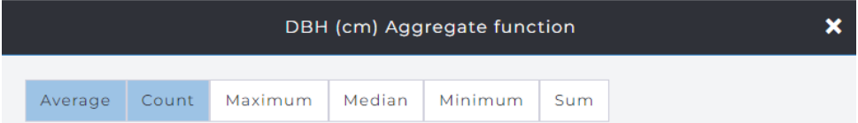

7. And then close the Aggregate function window by clicking the :guilabel:`X` button at the top-right corner. The in the result view, the DBH statistics will look as follows:
   
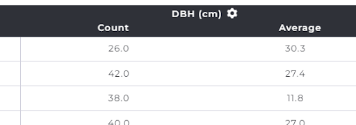

   

8. More `complex custom aggregate functions <https://www.postgresql.org/docs/9.5/functions-aggregate.html>`_  can be applied in the reporting, if needed. The aggregation uses the Structured Query Language (SQL) expressions which is the fastest method to run a database query in the Arena server.

.. image:: _static/media/Images/9/9.5/custom_aggregate_functions.png
   :width: 450
   :align: center
   :alt: Custom Aggregate Functions

9. After clicking SAVE, we can see the list of custom aggregate functions as follows:

.. image:: _static/media/Images/9/9.5/custom_aggregate_functions_list.png 
   :width: 450
   :align: center
   :alt: Custom Aggregate Functions

10. The reported custom aggregates need to be selected in order to see them in the report table.
    
11. Click the :guilabel:`X` to show the resultant display:

.. image:: _static/media/Images/9/9.5/aggregate_results_1.png
   :width: 4500
   :align: center
   :alt: Aggregate Results 

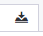

12. Data can now be exported as a CSV by clicking on the |downloadbutton| .

.. _map:

MAPS
====

Viewing Map Data
^^^^^^^^^^^^^^^^
If a survey contains a Sampling Point Data table or coordinate data, the locations of the points can be viewed on a map.Point locations can also be recorded using the map view. 

.. tip:: Base map data can be only viewed but not exported from Arena.

.. image:: _static/media/Images/9/9.6/'map_view.png
   :width: 600
   :align: center
   :alt: Viewing Map Data

By clicking on a map marker,a pop-up window with the “Edit record” functionality  allows users to open a floatable window on the top of the map view.

.. image:: _static/media/Images/9/9.6/clicking_map_marker.png
   :width: 700
   :align: center
   :alt: Viewing Map Data

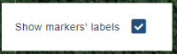

Markers in each layer will have a different colour, assigned randomly. 

At the lower right corner of the window the |showlabels| option to show/hide the markers’ labels. A label’s text consists of the key attributes (e.g. cluster_id - plot_no as above in the map view).

The markers (points) of the selected layers will be shown grouped in clusters. Each cluster of points is a circle with the number of grouped points. Clicking on the cluster or zooming sufficiently the actual locations will be visible as follow:

.. image:: _static/media/Images/9/9.6/markers_clusters_n_zooming.PNG
   :width: 500
   :align: center
   :alt: Viewing Map Clusters

The layers button located on the top  right button of the window,allows the user can select a base map from several options and subsequently the layer(s) to be shown (there will be one layer for each coordinate attribute defined in the survey).

.. image:: _static/media/Images/9/9.6/choosing_basemap.png
   :width: 400
   :align: center
   :alt: Choosing Basemaps

The maximum zoom levels for the `basemaps <https://developers.arcgis.com/documentation/mapping-apis-and-services/reference/zoom-levels-and-scale/>`__ are as follows: ‘ESRI Terrain’ 9, ‘ESRI Topographic’ 16; ‘Open Street Map’ 19; all others 17.

.. |zoomlevel|  image:: _static/media/Images/9/9.6/zoom_level.png

If the selected map service allows, the current zoom level is shown as a number next to the zoom buttons, as follows |zoomlevel|

**Working with Planet Data**

Through the Norway’s International Climate & Forests Initiative (NICFI) Satellite Data Program, anyone can now access Planet’s high-resolution, analysis-ready mosaics of the world’s tropics in order to help reduce and reverse the loss of tropical forests, combat climate change, conserve biodiversity, and facilitate sustainable development. In support of NICFI’s mission, you can use this data for a number of projects including, but not limited to:

- Advance scientific research about the world’s tropical forests and the critical services they provide.
- Implement and improve policies for sustainable forest management and land use in developing tropical forest countries and jurisdictions.
- Increase transparency and accountability in the tropics.
- Protect and improve the rights of indigenous peoples and local communities in tropical forest countries.
- Innovate solutions towards reducing pressure on forests from global commodities and financial markets.

Two types of NICFI mosaics can be selected: biannual mosaics and monthly mosaics. With NICFI data, there are two dropdown lists at the bottom of the screen to choose the capture dates of the images.

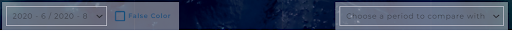

The basemaps cover the area between 30N & 30S comprising some countries. During the NICFI contract, users can expect to see bi-annual mosaics between the period of December 2015 to August 2020, followed by monthly mosaics from September 2020 onwards for the next couple of years.

.. _sampleimg:

Sample-based Image Interpretation
^^^^^^^^^^^^^^^^^^^^^^^^^^^^^^^^^

Sample-based Image interpretation in Arena allows to visually collect data from map and satellite images using sampling polygons and a set of control points. 

.. |samplebasedimage|  image:: _static/media/Images/9/9.7/samplebased_icon.PNG

The settings are defined in the **Home/Survey Info** section and defined using the |samplebasedimage| button.

There are two shape options: rectangle and circle

**Circular plots**

.. image:: _static/media/Images/9/9.6/circular_plot_structure.PNG
   :width: 700
   :align: center
   :alt: Circlular Sample plots

.. image:: _static/media/Images/9/9.6/circular_plot_n_choicelist.PNG
   :width: 500
   :align: center
   :alt: Circlular Sample plots

**Rectangular Plots**

.. image:: _static/media/Images/9/9.6/sample_based_image_interpretation.png
   :width: 700
   :align: center
   :alt: Recatangular Sample Points
   

.. image:: _static/media/Images/9/9.6/rectangular_plot_n_choicelist.PNG
   :width: 500
   :align: center
   :alt: Rectangular Sample plots

The control points are shown as small coloured polygons in a grid inside the sampling polygon. These are clickable: by clicking a point you can change its colour (with 5 colour options). The control points can be used to assess land or land cover features, such as proportions of land-use categories, forest coverage, etc. 

Offset North/East moves the samping polygon and the control points to the desired direction and distances. 

The “plot reference point” is an optional feature. This is a red point that can be used to mark for example a plot center point, if a grid is shifted with “offset” values.

**Data Collection Methods**

There are two methods to collect the data: 

1. using a Sampling Point Data table.
2. imputed records with coordinate data. 

When you click on the plot marker icon, Arena opens a pop-up window showing the following information.

+---------------------------------------------------------------------------------------------------------------+--------------------------------------------------------------------------------------------------------+
| .. image:: _static/media/Images/9/9.6/sampling_point_item.png               | **Sampling point Item**                                                                                |
|                                                                                                               | -Level code (in the Sampling Point Data),coordinates,elevation (derived from)                          |
|                                                                                                               | `Open Topo Data <https://www.opentopodata.org/>`_                                                      |
|                                                                                                               | -‘Create new record’ button,                                                                           |
|                                                                                                               | -Previous (<=) / Next (=>) buttons: move to the previous/next item in the Sampling Point Data table.   |
|                                                                                                               |                                                                                                        |
+---------------------------------------------------------------------------------------------------------------+--------------------------------------------------------------------------------------------------------+                                                                                                             
| .. image:: _static/media/Images/9/9.6/coordinate_record.PNG                 | **A record with coordinate data**                                                                      |                                      
|                                                                                                               | - record’s key attributes                                                                              |
|                                                                                                               | - coordinates (SRS as in imputed data) and elevation                                                   |
|                                                                                                               | - "Edit Record"  button                                                                                |
|                                                                                                               | - Owner of the record                                                                                  |   
|                                                                                                               | - Previous (<=) / Next (=>) buttons: move to the previous/next record in the record list               |                                                                                                        
+---------------------------------------------------------------------------------------------------------------+--------------------------------------------------------------------------------------------------------+                                                                                                             
| .. image:: _static/media/Images/9/9.6/extend_icon.PNG                       | -In the Edit Record view, this button opens up a floatable browser window that can be moved            |
|                                                                                                               | (for example to a second monitor)                                                                      |    
+---------------------------------------------------------------------------------------------------------------+--------------------------------------------------------------------------------------------------------+

It can happen that the maximum zoom level is reached and the markers are still clustered, meaning that the points are very close to each other or overlapping. Then clicking on a clustered marker opens up a pop-up showing a list of points in this cluster, and you can select the preferred item. 

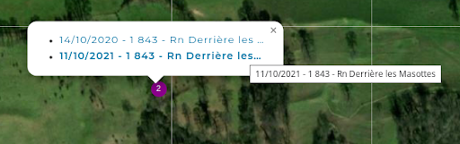

Google Earth Engine Queries via Earth Map
-----------------------------------------

`Earth Map <https://openforis.org/tools/earth-map/>`__ is an free Open Foris tool developed by FAO in the FAO – Google partnership framework. It allows users to easily visualize, process and analyze multi-temporal satellite imagery and `global datasets <https://help.earthmap.org/datasets>`__ on  climate, vegetation, fires, biodiversity, geo-social and other topics, using the 
`Google Earth Engine <https://earthengine.google.com/>`__ (GEE) data without coding. Users need no prior knowledge of remote sensing or Geographical Information Systems (GIS). 

Currently, we can make a GEE query for a polygon in Earth Map.The polygon submitted from Arena is the same as defined in the survey settings, see :ref:`the Sample-based image interpretation chapter <sampleimg>`. This polygon is called Area of Interest (AOI) in Earth Map.[4]

.. [4]

If there is no selection set in the Arena’s “Sample-based image interpretation” section, then Arena submits a polygon of 100m x 100m to Earth Map.
The following picture shows a circular sampling polygon in Arena’s Map view.

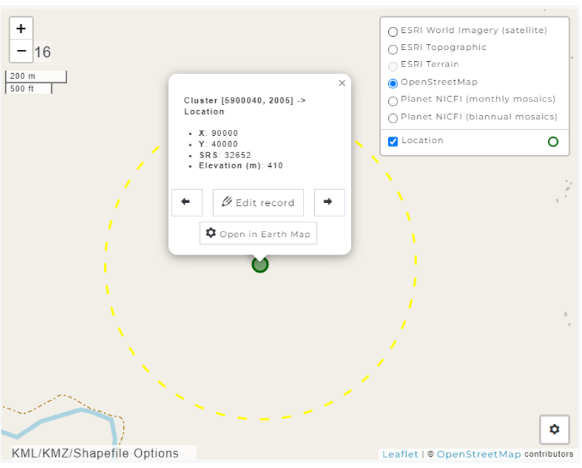

.. |earthmap|  image:: _static/media/Images/9/9.6/open_in_earth_button.png

By clicking on a point marker on the map with the |earthmap| button, Arena opens up a new web page with connection to Earth Map. First, you need to sign in and there are the following options:

.. image:: _static/media/Images/9/9.6/sign_in_options.png
   :width: 500
   :align: center
   :alt: sign in to Earth Map

With the :guilabel:`Continue as Guest` option, you can sign in without giving any information.

The same polygon submitted to Earth Map looks as follows(with query)

.. image:: _static/media/Images/9/9.6/polygon_view_from_query.png
   :width: 500
   :align: center
   :alt: Earth Map View

Running you GEE queries for the AOI using the **Statistics** tools(located on the right side of the page);

.. image:: _static/media/Images/9/9.6/stattistics_tools.png
   :width: 400
   :align: center
   :alt: GEE queries

You can get multitemporal results as well as seen below:

.. image:: _static/media/Images/9/9.6/multi_temporal_results.png
   :width: 700
   :align: center
   :alt: Multi-temporal Statistics

Polygon Data on the Map View
----------------------------

.. |kml|  image:: _static/media/Images/9/9.6/uploading_polygon.png

Arena allows users to upload polygon map on the map view. Hovering over the |kml| control will prompt the following pop-up;

.. image:: _static/media/Images/9/9.6/uploading_polygon_popup.png
   :width: 200
   :align: center

Arena’s map can show KML, KMZ, geojson or zipped shape files on the top of the base map (or satellite image), as shown in the next images. Notice that Arena Map does not automatically “fly” along the map to the location of the polygon layer. 

.. image:: _static/media/Images/9/9.6/arena_showing_polygon.png
   :width: 700
   :align: center
   :alt: Polygon Data on Map View
 

The opacity of the map layer can be changed with a range slider. You can also upload several map layers into the Arena map view, if needed.

.. image:: _static/media/Images/9/9.6/arena_showing_polygon_2.png
   :width: 700
   :align: center
   :alt: Polygon Data on Map View
 

.. Warning:: The uploaded map layer information is not stored anywhere. So, if you refresh the web browser window, all uploaded layers disappear. 

Data Export
-----------
Data from the current survey can be exported into a :code:`.zip` files that contains several :code:`.csv` files.

In the case of multicycle data users have the option to export data from either the selected cycle  or all data.
The zip file contains all attributes grouped by entities. 

To export data,on the left side panel, click on **DATA EXPORT** (under Data)which will list all the options available;

+---------------------------------------------------------------------------------------------------+---------------------------------------------------------------------------+
| .. image:: _static/media/Images/9/9.7/data_export_options.png   + - For categorical data,exports both code and labels(2 columns)            |
|                                                                                                   + - Includes category tables as separate files.                             |
|                                                                                                   + - Include computed result variables from RStudio process.                 |
|                                                                                                   + - In case of a multicycle survey, you can export data from all cycles.    |
|                                                                                                   + - Include all files (e.g. images, documents)                              |
+---------------------------------------------------------------------------------------------------+---------------------------------------------------------------------------+

Exporting files containg forest inventory looks like this;

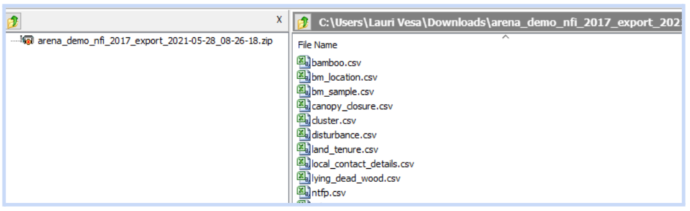

.. image:: _static/media/Images/9/9.7/record_cycle.png
   :width: 200
   :align: center

The first column in each exported table shows the cycle ("record_cycle").

.. Note:: Currently,data is exported from its current(highest level).In the later Arena versions there will be a selection that only Entry, Cleansing or Analysis level data can be exported.

Data Import
-----------

.. attention:: Always take a backup of your survey with data befire using the data import functionality. 
   
   - Remember a survey should be published before data import is possible.

Arena can import external data from;

- CSV files
- Open Foris Collect/Collect Mobile Files.

.. image:: _static/media/Images/9/9.8/data_import.png
   :width: 400
   :align: center
   :alt: Data Import Options

If you are adding new information into the database using :code:`.CSV` files, import your data by following a **top-down method!**
In the case of the survey structure described in the next chapter, first enter CLUSTER data as new records, then PLOT data with “update existing records”, and then similarly “Reference objects”, and so on.
 
Importing Data from CSV files
^^^^^^^^^^^^^^^^^^^^^^^^^^^^^
Data to be imported must be in a :code:`.CSV` file (in Unicode, UTF-8) i.e. the column separator is a comma. Each CSV file can contain data of one entity. The data entry contains several steps as will be described below ;

.. image:: _static/media/Images/9/9.8/import_from_csv_process.png
   :width: 500
   :align: center
   :alt: Data Import Cycle

**Step 1 : Select the Cycle**

In case of a multicycle survey,the uers has to select the target cycle (More Explained in the Cycles Chapter)

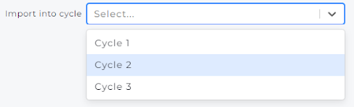

**Step 2: Select Import Type**

This gives two options;

.. image:: _static/media/Images/9/9.8/step_2.png
   :width: 400
   :align: center
   :alt: Import Type

a. The **Update existing records**: can be used if if the records are already entered and you can see the list in the RECORDS section, but you need to add missing data under the root entity, or you need to update existing data.
b. The **Insert New Records** : select this method if the survey is blank (i.e., no records yet), or the records to be imported are all new ones. Only the root level data can be imported as new records. All imported new records go into the Entry stage level.

For example,in the following survey "CLUSTER" is the root level entity and  a CSV file to be imported should only contain cluster data only.

.. image:: _static/media/Images/9/9.8/importing_into_entity.PNG 
   :width: 600
   :align: center
   :alt: Import Type

**Step 3:Select Entity**
Select the target entity to be updated from the hierarchy view by clicking on the entity’s name.
The hierarchy view provides three options as follows:

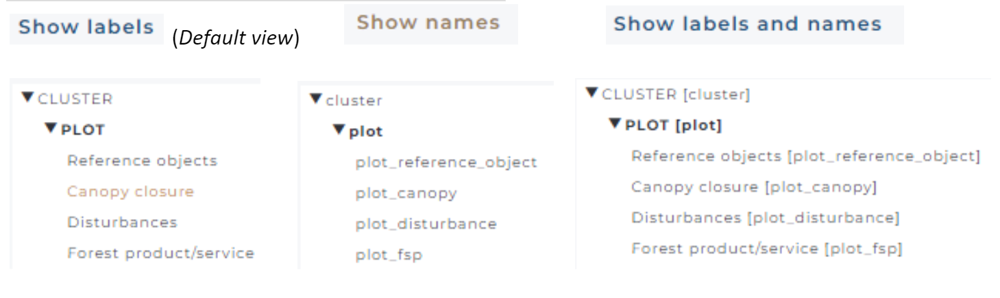

There are the following options in updating:

+---------------------------------------------------------------------------------------------------+---------------------------------------------------------------------------+
| .. image:: _static/media/Images/9/9.8/updating_options.png      + - Allow/Prevent adding new entities, such as new sample plots into the    |
|                                                                                                   +   database.[default:Allow]                                                |
|                                                                                                   +                                                                           |
|                                                                                                   + - Allow/Prevent updating records that are locked (i.e. in the Analysis    |
|                                                                                                   +   stage) [default:Prevent]                                                |
+---------------------------------------------------------------------------------------------------+---------------------------------------------------------------------------+

**Step 4:Select File**

Click on this box to select a file to be imported or drag and drop a file here:

.. image:: _static/media/Images/9/9.8/step_4.png
   :width: 400
   :align: center
   :alt: Selecting Files

.. |downloadtemplate|  image:: _static/media/Images/9/9.8/download_template_button.png

It is recommended that you apply data entry (CSV) templates. You can get these out by first selecting the entity name on the list, and then clicking on the |downloadtemplate| button.

See in the next table information about data types to be imported:

+------------------------------+------------------------------------------------------------------------------------------+
| Data Type                    |   Format                                                                                 |                                                                                              
+==============================+==========================================================================================+
| Numeric                      + Decimal separator is dot (.), for example 3.356                                          |                                                                                 
+------------------------------+------------------------------------------------------------------------------------------+
| integer                      +                                                                                          |
+------------------------------+------------------------------------------------------------------------------------------+
| Text                         +  A text that contains a comma should be in double quotes.                                |
|                              +    E.g. "The plot falls into a lake, not accessed                                        |
+------------------------------+------------------------------------------------------------------------------------------+
| Boolean                      + True/ False                                                                              |
+------------------------------+------------------------------------------------------------------------------------------+
| Categoricalc,Taxon           + code (these are read in as text)                                                         |
+------------------------------+------------------------------------------------------------------------------------------+
| Date                         + YYYY-MM-DD                                                                               |
+------------------------------+------------------------------------------------------------------------------------------+
| Time                         + HH:MM                                                                                    |
+------------------------------+------------------------------------------------------------------------------------------+
| Coordinates                  + Use three columns :                                                                      |
|                              + - attribute_name_srs: EPSG:CODE for example EPSG:4326                                    |
|                              + - attribute_name_x: numeric                                                              |
|                              + - attribute_name_y: numeric                                                              |
+------------------------------+------------------------------------------------------------------------------------------+

.. |validate|  image:: _static/media/Images/9/9.8/validate_file.png

After selecting a file, |validate| it to detect possible incompatibles with the target entity in the survey. The validation process only checks that the file contains valid data 
according to the **data type** of each attribute. Hence, this validation will not for example check that a numeric value is matching the (input) validation rule set for an attribute.

**Start Import**

Click on the :guilabel:`Start Import` button.

Importing Data from Collect/Collect Mobile File
-----------------------------------------------
Data can also be imported from  OF Collect and Collect Mobile.They however must be in :code:`.collect.data` format.

If a survey is created in OF Collect, and this survey is imported into Arena and published, data can also be imported into the Arena (later). This enables collection of data using OF Collect Mobile in data collection.  

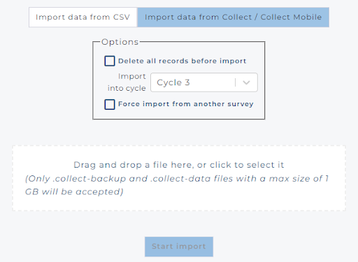

The checkbox *“delete all records before import”* means that all records (of the selected cycle) in the target survey will be deleted. Be cautious while using this selection! 

Selecting *“Force import from another survey”* allows importing data from a collect-data file, which may have different survey name in Collect than in Arena, but the same schema (i.e. source and target schemas match).

Validation Report
-----------------

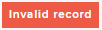

Errors in data can be detected by several means. While editing the data in Data Records, there can be an error |inavlidrecord| message indindicating that there is something wrong in the data. However, there is no easy way to find the erroneous data in the Data Records. So for searching and browsing the erroneous data, we should use the Validation Report tool.

The data validation report is a table that is created after running through all data validation checks in the survey.

.. Important:: It is essential to run this report and fix all errors in the data before the data enters the Analysis stage.If your data is already at the Analysis step , you cannot not edit the records. You need to submit the record back to Step 2.
 

In the case of multi-cycle dataset, the validation is executed for the selected cycle’s data only.

A validation report can look as follows:

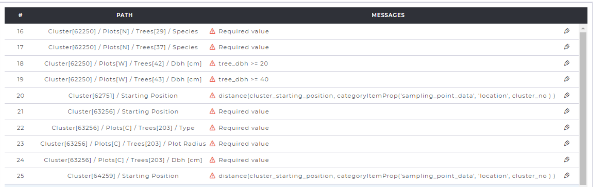

The validation report shows all records that have issues, either ‘Warning’ or ‘Error’. The Error message will be automatically generated, if the custom “Error Message” is left blank in the survey designing phase. 
The erroneous records can be directly accessed and edited from the Validation Report view.

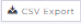

The validation report can be exported into a CSV file by clicking on the |csvexport| button. The CSV report contains more information than the screen view, and it looks in MS Excel as follows.

.. image:: _static/media/Images/9/9.9/validation_report_excel.png
   :width: 700
   :align: center
   :alt: Validation Report in Excel

ANALYSIS
========

Creating a Processing Chain
---------------------------

The data processing in Arena is handled with the help of R language script. Each survey has unique scripts, and the Survey Administrator or Data Analyst can add and modify the scripts. The data processing can be run using RStudio in the cloud, or locally with R and RStudio installed in the personal machine.

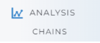

Data processing can be conducted with the help of a **calculation chain**, which contains the calculation of result variables. We will refer tocomputing these variables as calculation steps in this manual. A survey can contain more than one calculation chain, if needed, and one calculation chain can contain several calculation steps. However, **currently only one chain can be used to apply “Sampling Design” and “Statistical Analysis” methods.**

To create a new calculation chain;

1. Click on the :guilabel:`+ New` button.
2. Provide the following chain information.
   
**Case 1**: A survey with one cycle and one language.

.. image:: _static/media/Images/10/10.1/one_cycle.png
   :width: 600
   :align: center
   :alt: One cycle Chain   

**Case 2**: a survey with multiple cycles and languages.

.. image:: _static/media/Images/10/10.1/multiple_cycles.png
   :width: 600
   :align: center
   :alt: Multi-cycle  Chain   

**Input Fields**

- Processing  chain label (**Required**) :Name of the chain.
- Description (**Optional**) : Descriptive text about the chain.
- Sampling Design (**Optional**) :Tick if you have sampling-based data.
- Cycles: selected cycles to which this chain is applicable.
- Records: number of records on different steps (in the selected cycle)

Additionally,users have the option to use Rstudio in their analysis.Arena provides two options 

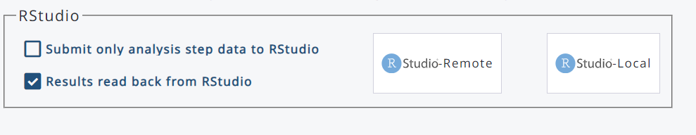

The **Submit only analsyis step data to RStudio** if selected ,only the analysis stage goes into Rstudio.

The **Results read back from Studio** on the other hand offers the option for result variables to be read back into Arena Server from RStudio.

A chain must contain at least one calculation step (i.e. result variable). You can add a quantitative (numeric) or a categorical variable (coded)

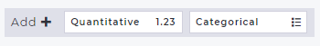

**Working with Quantitative Variables**

For example "tree volume" to be computes as a quantitative variable;

.. |quantitative|  image:: _static/media/Images/10/10.1/quantatitive_example.png

1. First, click the |quantitative| button.

2. Then, select the entity name from the dropdown list.

.. image:: _static/media/Images/10/10.1/quantitative_example.PNG
   :width: 700
   :align: center
   :alt: Defining entities

3. Then fill in the variable’s name, label (optional) and number of decimal digits (optional, used for reporting only). The variable names must be unique in a survey, i.e. two calculation chains can not contain a variable with the same name

.. tip:: If you are working with forest inventory data, please see the recommended naming approach in “Naming of entities, attributes and variables in Collect / Calc” at http://www.openforis.org/materials/ 

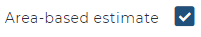

Check the |areabased|  box if you want to compute area-based results for the given variable, such as “volume per hectare” or “number of trees per hectare”.

.. note:: In Statistical Analysis we can only report area-based variables.

While renaming an area-based result variable;

1. Untick "area-based estimate" and approve the delete the node prompt.
   
.. hint:: The reason for doing this is that when you untick the checkbox, the system will delete an internal “variablename_ha” attribute from the database. When you tick it, the system will create a new attribute “newname_ha” into the database.
   
2. Rename your result variable.
3. Tick the |areabased| again.

4. The R script can be left untouched at this point, because it can be written later in RStudio. 
5. Then click the SAVE & BACK button to see the following results variables;

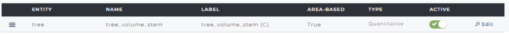
   

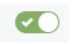

The |action| Acticate/deactivate variable button allows to include/exclude a result variable in the data processing in R.

.. Note:: If you have earlier processed your results with an “area-based” result variable that you want to deactivate, the results per hectare (“_ha”) will still emerge in the Data Explorer and in the CSV export data. If you want to remove this “per hectare” attribute, first deselect "area-based estimate" in the attribute’s properties page, and then deactivate that attribute. Then run the analysis chain again in RStudio.

**Categorical or Qualitative** result variables can be used for reporting or for grouping within the processing chain. 

.. |categorical|  image:: _static/media/Images/10/10.1/categorical_variable.PNG

1. You can add a new categorical result variable by clicking the |categorical| button.
   
2. Next fill in this table;
   
.. image:: _static/media/Images/10/10.1/categorical_variable_example.png 
   :width: 600
   :align: center
   :alt: Categorical variables

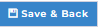

As in the quantitative variables computation,fill in the name and label (optional). The categorical variable needs to be linked with an existing (flat) categorical table. 

If that table does not exists yet, it you can create it with the :guilabel:`+Add` button.

If the category table already exists, click the :guilabel:`Manage` button, select the category from the list and click the :guilabel:`Select` button then the :guilabel:`X` button to close the list.Finally click the |save| button.
The calculation chain now looks as follows;

.. image:: _static/media/Images/10/10.1/Category_results.PNG
   :width: 700
   :align: center
   :alt: Categorical Chain 

.. note:: The order of computed variables may be really important! For example in forest inventory, above-ground biomass needs to be computed before the below-ground biomass. The order of variables can be changed by moving the cursor on the top of the icon on the left side of the name, and drag-and-dropping the variable to the right location.

   If the window gets "frozen" while moving the variables(as below),refresh your browser.

         .. image:: _static/media/Images/10/10.1/frozen_window.png
            :width: 500
            :align: center
            :alt: Frozen window

3. If an entity contains a result variable but no data, it will not be submitted into the processing in RStudio. You will see a warning sign, as in the image below.

.. image:: _static/media/Images/10/10.1/warning_message.png
   :width: 700
   :align: center
   :alt: Error notification

4. When all result variables are created, the survey needs to be published. Click the :guilabel:`Publish` button.

RStudio in Programming and Data Processing
------------------------------------------

The R scripts can be written, debugged and run using RStudio Integrated Development Environment (IDE) for R. The full processing chain is described in this next figure.

.. image:: _static/media/Images/10/10.2/r_methodology.png
   :width: 800
   :align: center
   :alt: R processing chain

Arena offers two options to use Rstudio;

.. |remote|  image:: _static/media/Images/10/10.2/r_remote.PNG

.. |local|   image:: _static/media/Images/10/10.2/r_locale.PNG

a. |remote| : Rstudio server in the cloud.
   
b. |local| :  locally installed Rstudioin your machine.

To run RStudio locally,the following requirements must be met;

- R version 4.1.3 or newer.
- you should have the package 'rstudioapi' installed,
- you need to have an Internet connection,
- start a new RStudio session.

To use RStudio for both options,the process is as follows;

1. Publish the survey.(This is required if there have been any changes in the survey, data or chain.)
2. Select whether you want to **submit all data or only analysis step data** to RStudio. 

.. Note:: In case of multicycle data, **only data of the selected cycle**  will be submitted to RStudio.

3. Click the :guilabel:`RStudio` button.

.. tip:: If there's no data i.e numbers of records shows zero ,you cannot start the RStudio process.

4. Arena will show this message(the scripts are different for the server and local RStudio)

.. image:: _static/media/Images/10/10.2/only_analysis_result.png
   :width: 700
   :align: center
   :alt: R processing message

5. Click **OK**.
   
Arena will automatically copy the initiatilzation script to your clipboard.( The initialization script is valid for 60 minutes, after which it expires).

6. Initialization
   
- Server :RStudio will start. 
- Local:Start R Studio on your machine.
  
7. Paste(Ctrl+V) the copied script into the RStudio Console window and run it. This will upload all scripts into Rstudio (from Arena’s PostgreSQL database).  
8. In the files view ,you will see this content;

.. hint:: When using local RStudio in a Windows machine, the files are downloaded into the following folder: C:/Users/USERNAME/Documents/arena

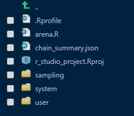

.. caution:: 
   - arena.R = the main program (do NOT edit it!)
   - /system = folder for system-generated files (do NOT edit!)
   - /sampling = scripts for base unit weight and plot areas (edit these)
   - /user = folder for result variables (these you will edit)

9. The startup script will automatically open the file **arena.R** .Run the first two (2) lines of the code.

.. image:: _static/media/Images/10/10.2/startup_script.png
   :width: 600
   :align: center
   :alt: R processing

The file **001-init.R** contains system initializing commands, such as access to the database management system. In Rstudio Server, it also installs a great number of packages into your RStudio session. In local RStudio, only a few essential packages are installed (if they have not been installed already).[5]

The list of all installed packages can be viewed here: [home]/system/init/init-packages.R

Running this script takes a few seconds, when a new RStudio session is opened. Next time running this script goes faster. 

In case of errors in the R Console,you should see them as follows;

.. image:: _static/media/Images/10/10.2/r_processing_image.png
   :width: 600
   :align: center
   :alt: Error In r

:code:`002-login.R` opens **two input boxes** in order to get access to your data in the Arena database: first type your username (email) to Arena, and then your password. For security reasons, your password is masked with asterisks.

.. image:: _static/media/Images/10/10.2/password_prompt.png
   :width: 400
   :align: center
   :alt: R processing

After a successful login,you should get a message into the R console that looks like this:

*"User myusername@x.org successfully logged in"*

10. Run the **third line** of the code; :code:`source('system/003-read-data.R')`
    
This will initialize the variables (as data frames) and download the data. See the **Environment window** in RStudio.

The following data will be added into the R project;

- Data of all entities in the chain, 
- Data of the Base unit entity, and Clustering entity,
- All categorical and taxonomic lists, and 
- Schema Summary table (‘arena.schemaSummary’).

11. Open the **/user** folder
    
.. image:: _static/media/Images/10/10.2/use_folder.png
   :width: 350
   :align: left 
   :alt: User file   

This folder contains the common file for adding R scripts (as functions) that are common for all calculation steps following file 004-common.R

.. important:: When using R packages,the following need to be adhered;

   - Try to write all package loads into 004-common.R, because it will be the easiest to manage them just in one file. 
   - RStudio RServer is running on a Linux machine. Some packages may not run on Linux.
   - While calling new packages, avoid using the ‘library’ command. Instead, use the function call ‘usePackage’, as follows-usePackage(”lmfor”) or usePackage(‘lmfor’).This function checks whether a package is pre-installed or not. If not, then it will be installed. This is the source of usePackage (in the system file init-packages.R):
 
   .. image:: _static/media/Images/10/10.2/r_packages.PNG
      :width: 400
      :align: center
   
   - Because in a RStudio session there might be a high number of active packages, it is better to write the package name in the front of a function call, as follows :code:`dplyr::select(),  dplyr::filter()` etc.

12. All files in the **folder/user** and below are the ones that will require working. For working methods with the R-scripts, please see hints in the OF `Calc manual <http://www.openforis.org/tools/calc/calc-tutorials/calc-user-manual/>`_ (from p.39)
    
.. note:: In 2023, online video tutorials will be available on how to write scripts into Arena. Also later the templates containing embedded R scripts will be available to facilitate the data processing part.

In the RStudio project, all data are in the data frames by entities. In addition, there are the following two lists (of data frames): *categories* and *taxonomies*. For example: if the survey contains a code list ‘land_use’, it can be accessed as a data frame as follows: *categories$land_use.* 

Taxonomic data frames can contain extra properties, such as dry wood densities by species. These fields are stored as character data types in Arena, so they need to be converted to numeric when they are used in data processing scripts.

..  |source| image:: _static/media/Images/10/10.2/source_icon.PNG

13. When all scripts are tested, saved, and can run error-free, you need to run the source code of the main program. So select window of arena.R and click the |source| icon

This will return all R scripts and write computed results data back to Arena’s database.  If a chain contains parameters for Sampling Design and Statistical Analysis, the result tables will be written into CSV files (read more :ref:`here <results>`)

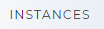

14. **RStudio Server**: After a successful run, you can close your RStudio session. Go to the Arena’s main window, choose |instances| and terminate the RStudio connection.

.. image:: _static/media/Images/10/10.2/terminating_r_connection.png
   :width: 400
   :align: center
   :alt: Terminating instances

Terminating the connection will release server resources to other RStudio users in the cloud services.

**If RStudio Server doesn't start**

If you see this type of error in the web browser

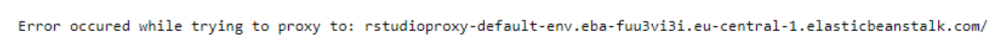

It means that the RStudio Server instance cannot start at this moment. In this case, wait for 5-10 minutes and try again. This may happen in cases where there is a high number of users trying to access the system at the same time.

**External files( e.g. CSVs,graphic files)**

If you work with the Studio Server and want to create new files during the run-time, such as CSV files or graphic files, please see the guidance at :ref:`Annex3<annex3>`

**Error Handling**

In **arena.R** ,each module call in the chain contains an argument to collect errors, as you can see here below.

.. image:: _static/media/Images/10/10.2/error_handling.png
   :width: 450
   :align: center 
   :alt: Error handling in r

All errors are collected into a list, and this list is evaluated in the **system/persist-user-scripts.R** where the user’s R scripts are written back into the Arena server. However, if there are errors in this list, the process of running the chain will be terminated, and there is a warning text in the R Console. You should fix all errors before the process can be fully executed.

After an error crash, first fix your erroneous R code. Next, there are basically three options how to clean the error log, and rerun the scripts:

1. Start running the chain from **system/init.R.** will clean the error log, but the disadvantage of this method is that the chain will read your data again from the server into RStudio, and maybe you will need to wait (for a long time) again; or
2. Run the function **cleanGlobalErrors()** in the R Console and start running your chain from the selected (fixed) module; or
3. Add the command line **cleanGlobalErrors()** into 000-common.R, and start running the chain from 000-common.R
   

Sampling Design and Statistical Analytics
-----------------------------------------

Sampling Strategy
-----------------
A sample strategy is the combination of sample design along with an estimator (formula) from which is calculated an estimate for a parameter of interest. For many strategies the sample design and formula are so closely associated that the term “design” is used when “strategy” is meant, we will follow this convention. 

Arena supports the following sampling strategies [6]

- Simple random sampling and systematic sampling;  
- Stratified sampling
- Single stage or cluster sampling.

**Definitions and Background**

Most forest inventory measurement protocols use a set of circles or rectangles; the set is arranged geometrically around the sample point for the set, see figure below. 

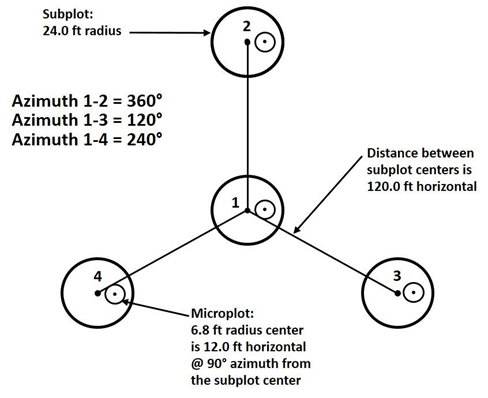

In a majority of inventories the set is referred to as a cluster and individual elements are referred to as plots. One exception is the Forest Inventory and Analysis (FIA) program of the United States Forest Service, which refers to the set as a plot and individual elements as subplots. To avoid confusion between the two uses of “plot” we will refer to the FIA set as the FIA-plot. 

In Open Foris Calc, the smallest unit of measured area is called a **base unit** and it is assumed that the base unit is of a single stand type. For many inventories the plot is the base unit. Although in some inventories the plot can be mapped into different stand types. One example of this is FIA, which has the field crews divide the subplots into different stands if there is a stand boundary which can be repeatedly mapped.

Typically trees are measured on clusters of plots, where the plots may vary in size and/or number depending on the diameter class of the tree.  Therefore each entity that contains “area-based” variable(s) gets a new result attribute automatically in a processing chain, for example “tree” gets attribute **tree_plot_area_”.**

Settings for sampling design
^^^^^^^^^^^^^^^^^^^^^^^^^^^^
The Sampling Design page contains a form for a description of the survey strategy. The form looks as follows:

.. image:: _static/media/Images/10/10.4/statistical_analysis_settings.png
   :width: 700
   :align: center
   :alt: Sampling Strategy

The content is as follows:

+------------------------------------------------+---------------------------------------------+----------------------------------------------------------------------------------+
| Line                                           |  Required ?                                 |         Explanation                                                              |
+------------------------------------------------+---------------------------------------------+----------------------------------------------------------------------------------+
| Base unit                                      | Yes                                         | The smallest unit of measured area                                               |
+------------------------------------------------+---------------------------------------------+----------------------------------------------------------------------------------+
| Sampling Strategy                              | Optional                                    |  Options:                                                                        |
|                                                |                                             |  0:None                                                                          |
|                                                | If NONE,stastical analysis is not executed  |  1: Random sampling                                                              |
|                                                |                                             |  2: Systematic sampling                                                          |
|                                                |                                             |  3: Stratified random sampling                                                   |
|                                                |                                             |  4: Stratified systematic sampling                                               |
+------------------------------------------------+---------------------------------------------+----------------------------------------------------------------------------------+
|Stratum attribute                               | Yes, if stratified sampling strategy        |  Select a categorical attribute (base unit or its parent level).                 |
|                                                |                                             |  Only one attribute can be selected                                              |
|                                                |                                             |  This can also be a categorical result attribute.                                |
|                                                |                                             |  Areas of strata should be given in.                                             |
|                                                |                                             |                                                                                  |
+------------------------------------------------+---------------------------------------------+----------------------------------------------------------------------------------+
|Clustering entity (within cluster sampling)     | Optional                                    |  Set the clustering entity.                                                      |
|                                                |                                             |  In cluster sampling, results are aggregated first at the base unit level,then at|
|                                                |                                             |  the cluster level and then at the domain level(strata/reporting unit)           |
|                                                |                                             |  If blank,a single stage survey                                                  |
|                                                |                                             |                                                                                  |
+------------------------------------------------+---------------------------------------------+----------------------------------------------------------------------------------+

All selections in the “Sampling Design” will be submitted as a JSON file into the R project, and they will be available as a named list **arena.chainSummary** in RStudio. 

..  |downloadjson|  image:: _static/media/Images/10/10.4/download_json_button.png

The :code:`JSON` file can be directly downloaded with the |downloadjson| button.

Read more about JSON files in Arena in :ref:`Annex 5<annex5>`

Areas for strata
^^^^^^^^^^^^^^^^
Stratified sampling requires computation of inclusion probabilities by stratum. In Arena, inclusion probabilities are expressed as “expansion factors” (which are equal to the inverse of inclusion probability).

There are two methods in Arena script to compute expansion factor for a base unit:

a. Computation with the help of sample weights in stratum, i.e. Exp_factor = [base unit weight in stratum] /  (sum([base unit weights in stratum])

This method however does not allow you to compute “Totals” (such as total volume, biomass) correctly. However, per hectare results can be computed.

b. Areas of stratum is known, i.e.Exp_factor = [area in stratum] /  (sum([base unit weights in stratum])

In this case, sampling areas must be given. These are given via the category table of the stratification entity, in a column named “area”. All areas are given in hectares (or acres). 
The total inventory area is the sum of the column “area”. The content of the ‘reporting table’ is described next.

**Case 1**: Stratified Sampling.The areas of strata as a CSV file in the "Categories" section for the attribute "stratum".

.. image:: _static/media/Images/10/10.4/stratified_sampling_categories.PNG
   :width: 300
   :align: center

Settings for Statistical Analysis
^^^^^^^^^^^^^^^^^^^^^^^^^^^^^^^^^
The chain section contains a third tab :guilabel:` Statistical Analysis` that allows you to set instructions for the statistical analysis of the data in RStudio.

.. image:: _static/media/Images/10/10.4/statistical_settings.PNG
   :width: 700
   :align: center
   :alt: Statistical Analysis Settings

The following parameters are available for statistical analysis.

+------------------------------------------------+---------------------------------------------+----------------------------------------------------------------------------------+
| Line                                           |  Required ?                                 |         Explanation                                                              |
+------------------------------------------------+---------------------------------------------+----------------------------------------------------------------------------------+
| Entity                                         | Yes                                         | entity to report, (currently only one entity can be selected!)                   |
+------------------------------------------------+---------------------------------------------+----------------------------------------------------------------------------------+
|Dimensions                                      | Yes                                         |  Select the dimensions for reporting.                                            |
|                                                |                                             |  The list contains all categorical,taxon,boolean attributes of the selected      |
|                                                |                                             |  entity and its parents.                                                         |
+------------------------------------------------+---------------------------------------------+----------------------------------------------------------------------------------+
|Filter                                          |Optional                                     |  R clause for filtering the data for analysis                                    |                                           
|                                                |                                             |  If there is an error in the syntax, the script skips filtering rules            |
|                                                |                                             |  and a warning will be given in the R Console.                                   |
|                                                |                                             |                                                                                  |
|                                                |                                             |                                                                                  |
+------------------------------------------------+---------------------------------------------+----------------------------------------------------------------------------------+
|Reporting Method                                | Yes                                         |  Combination / Separately (default)                                              |
+------------------------------------------------+---------------------------------------------+----------------------------------------------------------------------------------+
| Clustering only for variances                  |  Optional                                   | As a single stage survey.                                                        |
|                                                |                                             | If a clustering entity is set, but in analytics the  clusters are not used to    |
|                                                |                                             | aggregate the data while computing the means,but only for variance.              |
+------------------------------------------------+---------------------------------------------+----------------------------------------------------------------------------------+
| Non reponse bias correction                    |  Optional                                   | If checked, calculation requires a category table 'sampling_units_plan' that     |
|                                                |                                             | contains the sampling design (i.e. planned number of samples,and clusters if     |
|                                                |                                             | clustered sampling).                                                             |                  
|                                                |                                             | See more information below.                                                      |
+------------------------------------------------+---------------------------------------------+----------------------------------------------------------------------------------+
|P-value                                         | Yes                                         |  Stastical P-value.                                                              |
|                                                |                                             |  Used for computing confidence intervals                                         |
+------------------------------------------------+---------------------------------------------+----------------------------------------------------------------------------------+
|Total reporting area (ha)                       | Optional                                    |  Area of interest for reporting "totals"                                         |
+------------------------------------------------+---------------------------------------------+----------------------------------------------------------------------------------+

Arena can execute a statistical analysis for all **area-based (active) quantitative result variables**, as shown next.

.. image:: _static/media/Images/10/10.4/area_based_statististical_variables.png
   :width: 700
   :align: center

Currently, only one entity, such as ‘tree’ in the picture above, can be selected for computing the results.

The following conditions should filled in order run the analysis script:

- BASIC: The entity to be reported contains active area-based quantitative result variables in the chain,
- BASIC: Sampling Design is selected,
- SAMPLING DESIGN: Base unit entity is given,
- SAMPLING DESIGN: Sampling strategy is selected,
- STATISTICAL ANALYSIS: Entity to report is selected and this entity contains data,
- STATISTICAL ANALYSIS: at least one dimension is selected.

The execution of the statistical analysis script will take place in the RStudio project in the file system/statistical-analysis.R. This file calls an R script located in the `ARENA GitHub repository (“arena-r”) <https://github.com/openforis/arena-r>`_

The data for the analysis run will be inherited from the Arena processing chain. Similarly in case of multicycle data, only the data from the selected cycle will be submitted into the analysis.

Area for Statistical Analysis
^^^^^^^^^^^^^^^^^^^^^^^^^^^^^

If the extent of samples are known (such as sampling plot areas in forest inventories), Arena’s script can always compute results per hectare basis, such as tree volume per hectare. For computing the “total” results for a given area of interest (AOI), such as total tree volume, the user has to give this area. The method of giving the AOI (extent) depends on the sampling strategy, as follows:

1. **Non-stratified sampling**
   
Under the tab sheet "Statistical Analysis",give the area into this line:

.. image:: _static/media/Images/10/10.4/non_stratified_sampling.png
   :width: 500
   :align: center

2. **Stratified  random sampling**
   
Here,the total AOI is known but the areas of strata are not known in advance:

Same as in Case #1. Areas of strata are computed according to proportion of strata (i.e. sum of weights in stratum divided by the total sum of weights across all strata). 

3. **Stratified Systematic Sampling**
   
The areas of strata are known in advance: Areas(ha)are given within the attribute's category as an "extra property" as follows:

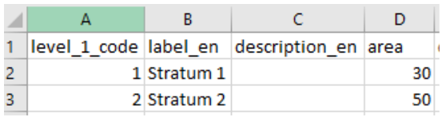

4. AoI (extent) is not known or its not relevant:the script assumes the reporting area is equal to 100 ha.

Non-response bias corrections
^^^^^^^^^^^^^^^^^^^^^^^^^^^^^
A problem common to nearly all sample-based surveys is partial or complete non-response from some of the selected sample units. Arena script can apply the so-called ‘naive imputation’ method and compute weight adjustment factors based on the planned number of sampling units. In this case, missing observations are ignored and an adjustment factor is incorporated into a sample weight to compensate for non-response or situations where all or part of a sample (plot) falls outside the population.

The non-response bias correction requires information about the planned number of Primary Sampling Units (PSUs) and Secondary Sampling Units (SSUs).

In a forest inventory, Primary Sampling Units can be sample plots or clusters, by strata in case of stratified sampling. Secondary Sampling Units can be sample plots.

In stratified sampling, the number of PSUs and SSUs are given within the stratum attribute’s category table, as follows:

.. image:: _static/media/Images/10/10.4/stratified_sampling_psu_ssu.png
   :width: 500
   :align: center

In the example above, the area of Stratum 1 is 30 ha, and the initial number of clusters (PSUs) is 85, and the number of sample plots in a cluster is 4. 

In the next example, the non-response bias correction is not computed for missing clusters, but only for missing sample plots (SSUs):

.. image:: _static/media/Images/10/10.4/nonresponse_bias_correction.png
   :width: 500
   :align: center

And in the next example, the non-response bias correction is computed only for missing clusters (PSUs) in strata, but not for sample plots (SSUs):

.. image:: _static/media/Images/10/10.4/nonresponse_bias_correction_psu.png
   :width: 500
   :align: center

If this lookup table is missing or its format is incorrect, Arena’s R script can not compute non-response bias corrections.

**Stratified sampling case:**

- **level_1_code**: stratified, give the stratum attributes’ codes (text)
- **label_en**:    	Label (text)
- **area**:          stratum area (in hectares. Optional) 
- **design_psu**: 	planned number of primary samples (such as clusters) in strata (numeric)
- **design_ssu**: 	planned number of samples (such as plots) in clusters (numeric)

**Non-stratified sampling case:**

..Coming soon

The computed non-response bias correction factors for PSUs are written into a CSV file:
*[stratificationAttributeName]–-PSU_nonresponse_correction.csv*

.. note:: This part of the Arena platform and R scripts will be further developed by the OF Arena Team and changes will be documented in this manual and the `GitHub repository <https://github.com/openforis/arena-r>`_

.. _results:

Results from statistical analysis
^^^^^^^^^^^^^^^^^^^^^^^^^^^^^^^^^

The `R Script <https://github.com/openforis/arena-r>`_ computes estimates for given dimensions, either as a combination of dimensions or separately. The “combination” means that all possible combinations of dimensions (in the data) will be reported. The “separately” method will write each selected dimension into a separate result table under a folder named according to the dimension name.

The result statistics contain means, totals, and associated standard deviations, variances, confidence intervals, and sample sizes. In addition, in case of a stratified (or post-stratified) sampling, efficiency of stratification is computed. “Totals” are reported correctly only if the column “area” is set for the selected stratification attribute (in its code list table). The following notation is applied within the column names in the result tables:

- .total         = sum
- .mean          = average
- .sd            = standard deviation
- .var           = variance
- .ci_lower      = lower confidence limit
- .ci_upper      = upper confidence limit
- tally          = number of samples

Variance estimation in sample surveys involves variances computed within primary sampling units (PSUs). If only one PSU is sampled from a particular stratum, the variance can't be computed (there is no unbiased estimator). In Arena’s analysis script, a single-PSU stratum makes no contribution to the variance

.. hint:: The analysis script uses the following R packages: survey, srvyr. We apply the *‘survey’ package lonely.psu* option as follows: *options(survey.lonely.psu="remove")*.

**Location of the result files**

1. RStudio Server: downloaded automatically as a zip file. When you get this message, check if you have some pop-up blocker active; in that case disable it or enable opening external windows from that location and click on the “Try Again” button:

.. image:: _static/media/Images/10/10.4/results_files_location.png
   :width: 400
   :align: center

2. Local Rstudio:
   
- Windows: ~/Documents/arena/SurveyName-Date-Time/user-output/
- Mac:  coming here later
- Linux: ~/arena/SurveyName-Date-Time/user-output/

.. note:: The result tables are not written back into Arena’s main database.

**Example 1**

.. image:: _static/media/Images/10/10.4/example1.PNG
   :width: 700
   :align: center

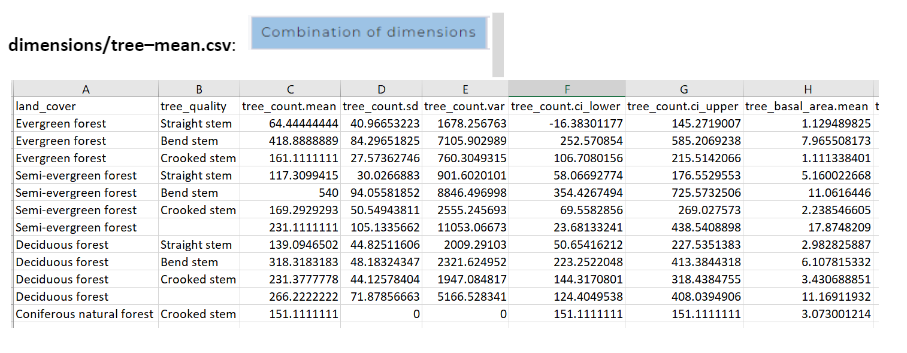

**Note: the last column in this table shows the number of samples in the data.**

**Example 2 :Dimensions Separately**

The selected entity to report is ‘tree’, and the dimensions are ‘land_cover’ and ‘management_status’, and the dimensions are reported separately.

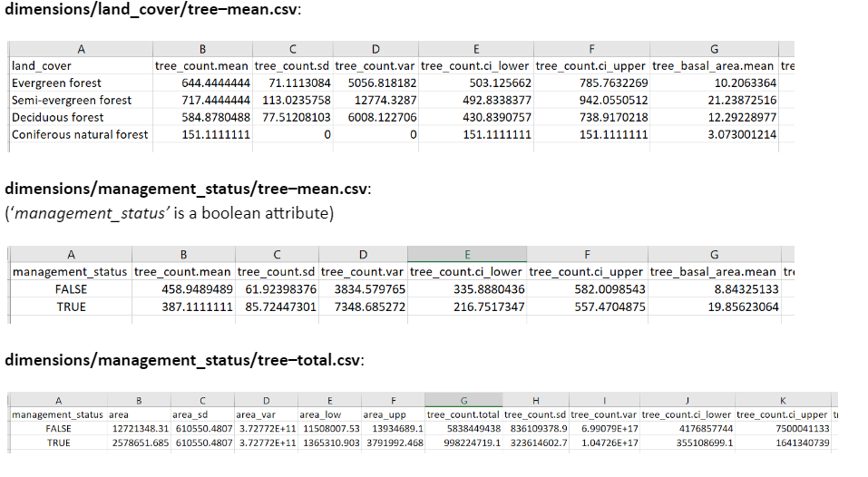

The results for all data, totals across all domains are summed up into the table tree–global_total.csv:

.. image:: _static/media/Images/10/10.4/example2_2.PNG
   :width: 700
   :align: center

The results for all data, means across all domains are listed in the table tree–global_mean.csv:

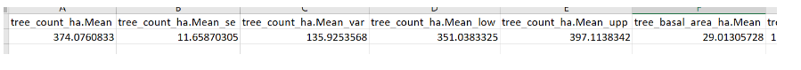

.. Note:: The script can compute this table (of means) only in the following cases:

   - The reporting method is “Dimensions separately” AND the list of dimensions contain at least one attribute that is at the base unit (or higher) level, or 
   - The reporting method is “Combination of dimensions” AND all attributes in the list of dimensions are at the base unit (or higher) level.

If the sampling design applies stratification, the script can compute the relative efficiency of sampling (compared against a random sampling) by all quantitative result variables, as shown in the following table.

**tree-relative_efficiency.csv**:

.. image:: _static/media/Images/10/10.4/tree_relative_efficiency.png
   :width: 300
   :align: center

The folder “/sampling unit results” contains all "per hectare" data (i.e. means) summed up to the base unit level.

.. image:: _static/media/Images/10/10.4/example3.PNG
   :width: 600
   :align: center

If the sampling design is clustered, then the folder “/sampling unit results” contains also "per hectare" data (i.e. means) summed up to the cluster level.

.. image:: _static/media/Images/10/10.4/example_4.PNG
   :align: center

where ;

- n_baseunits: number of base units in cluster
- sum_weight: sum of base unit weights in cluster

Deleting a Chain
----------------

.. |dc|  image:: _static/media/Images/10/10.5/delete_chain_button.png
   
A calculation chain can be deleted on the form BASIC by clicking the |dc| button . **This action can not be reverted**

EXPRESSIONS IN ARENA
====================
Arena uses Javascript programming language for expressions. Because some users may be familiar with XPath language expressions used in OF Collect, the next tables represent expressions with both these languages.

.. Note:: In JavaScript, a string is a sequence of characters enclosed in single (‘) or double (“) quotes. The choice of quoting style is up to the programmer.

**Operands**

The following operands can be used in Arena;

AND:  && , OR : || , NOT: !

Equal to: == , not equal: != , Less than: <, <=, Greater than: >, >=

Multiplication: * , Division: / , Modulo: % ,  Exponentiation: ** 

See more `Here <https://developer.mozilla.org/en-US/docs/Web/JavaScript/Reference/Operators>`__

All examples of expressions can be found in this `online document <https://docs.google.com/document/d/1FsD1kARO7wtY-ZYXR84TFTDn2JhRlKsVDJdqPvEXkpk/view>`__

.. Tip:: We are constantly adding or updating the document with new expressions.

Some of the expressions included in the document cover:

- 12.1. "Relevant If" and "Apply If" rules.
- 12.2. Methods and Functions.
- 12.3 Data Validation.
- 12.4. Items Filter Expressions.

ACKNOWLEDGEMENTS
================

This chapter covers the organizations and individuals whose collaboration have made Arena possible.

The Open Foris Arena platform has been built with the support of :

- The Government of Norway and the UN-REDD Programme through the Food and Agriculture Organization of the United Nations (FAO).
- The Ministry for Foreign Affairs, Finland.
- The Government of the United Kingdom (Aim4Forests).
  

   

The deepest thanks to the developers of the system: Cosimo Togna, Stefano Ricci, Ramiro Blazquez-Gonzalez, Lauri Vesa, Diego Perez Sastre, Miró Sorja, Stefano Giaccio, Daniel Koch and Elias Kunnas. 

The Arena logo is designed by Jérôme Agostini. 

Other contributors in the development have been Javier Garcia Perez, Rebecca Tavani, Julian Fox and Anssi Pekkarinen.

.. _systemarch:

.. _annexes:

ANNEXES
=======

This section of the documentation  provides supplementary materials to complement the core documentation, 
offering users additional resources for deeper understanding and practical application of the tool. 

Annex 1 :System Architecture
----------------------------

OF Arena is built with JavaScript programming language with the system based on the following components:

- Static front-end in React.js 17.x
- Back-end in Node.js 14.x
- Database Management System: PostgreSQL 10.x/11.x
- Amazon Web Services (AWS),
- Leaflet JavaScript library for interactive maps,
- System front-end and back-end will communicate via Web Socket connection, and the OF authentication system uses local user storage. OF sends notifications via email.
- External data: OF users can upload files into the system,
- Open Foris integrates with RStudio server,
- Local off-line installation and usage via `docker <https://github.com/openforis/arena/blob/master/README.md>`__
- OF Arena uses cookies, so they should be allowed in the web browser. The system is tested with the following web browsers: Google Chrome (recommended), Windows Edge and Opera.

Annex 2: Abbreviations and Acronyms
-----------------------------------
+------------------------------+------------------------------------------------------------------------------------------+
| Abbreviations                |   Definition                                                                             |
+------------------------------+------------------------------------------------------------------------------------------+
| AOI                          +  Area of Interest                                                                        |
+------------------------------+------------------------------------------------------------------------------------------+
| AWS                          +  Amazon Web Services                                                                     |
+------------------------------+------------------------------------------------------------------------------------------+
| CSV                          +  Comma Separated File                                                                    |
+------------------------------+------------------------------------------------------------------------------------------+
| DBH/dbh                      +  Diameter at the breast height(1.3 m) of a tree.                                         |
+------------------------------+------------------------------------------------------------------------------------------+
| EM                           +  Earth Map (https://openforis.org/tools/earth-map/)                                      |
+------------------------------+------------------------------------------------------------------------------------------+
| EPSG                         +  EPSG Geodetic Parameter Dataset (also EPSG registry)                                    |
+------------------------------+------------------------------------------------------------------------------------------+
| FAO                          +  Food and Agriculture Organization of the United Nations                                 |
+------------------------------+------------------------------------------------------------------------------------------+
| GEE                          + Google Earth Engine                                                                      |
+------------------------------+------------------------------------------------------------------------------------------+
| Identifier                   + Identifier                                                                               |
+------------------------------+------------------------------------------------------------------------------------------+ 
| IDE                          + Integrated Development Environment                                                       |
+------------------------------+------------------------------------------------------------------------------------------+
| JS                           +  JavaScript                                                                              |
+------------------------------+------------------------------------------------------------------------------------------+
| JSON                         +  JavaScript Object Notation                                                              |
+------------------------------+------------------------------------------------------------------------------------------+
| NA                           +  Not Available                                                                           |
+------------------------------+------------------------------------------------------------------------------------------+
| OF                           +  Open Foris                                                                              |
+------------------------------+------------------------------------------------------------------------------------------+
|  R                           +  'R' Programming Language                                                                |
+------------------------------+------------------------------------------------------------------------------------------+
| SQL                          +  Structured Query Language                                                               |
+------------------------------+------------------------------------------------------------------------------------------+
| SRS                          +  Spatial Reference System                                                                |
+------------------------------+------------------------------------------------------------------------------------------+
| UUID                         +  Universally Unique Identifier                                                           |
+------------------------------+------------------------------------------------------------------------------------------+

.. _annex3:

Annex 3: RStudio Server
-----------------------

Writing and downloading files created during run-time
^^^^^^^^^^^^^^^^^^^^^^^^^^^^^^^^^^^^^^^^^^^^^^^^^^^^^

Because RStudio Server works on a remote server, getting files, such as :code:`.CSV` files or graphic files, created by the R scripts from the server to the user’s machine requires special methods.

In this section,we will go through this:

1. Write this script into **004-common.R:**
   
.. code::

   # define a folder for output files
   user_file_path <- './user_output/'
 
  # create a folder for files to be exported
  if (!dir.exists( user_file_path )) dir.create( user_file_path, showWarnings = FALSE )

  cat( normalizePath(user_file_path) )

Optionally, you can also use a function to add all “user’s files” into a zip file (arena_R_export.zip) which can be downloaded (after running the project files). Add also this script into **004-common.R** (after the script above):

.. code::

   zip_user_files <- function(tFolder) {
   #delete zip if it exists (i.e., file to be downloaded)
   fn <- paste0( tFolder, "arena_R_export.zip ")
   if (file.exists(fn)) {
    #Delete file if it exists
    file.remove(fn)
   }
  
   # check if any files to be zipped
   f <- list.files(tFolder, all.files=TRUE, recursive=TRUE, full.names=FALSE)
   if (length(f) > 0) {
    zip::zip("arena_R_export.zip", f, recurse=TRUE , root=tFolder, include_directories = TRUE, 
            mode = "mirror")
    }
   } 

.. note:: Add script  zip_user_files( user_file_path ) into the very last calculation step.

2. When you need to write something into a CSV file, use this type of command line:
    
.. code::

   write.csv(my_DF, paste0( user_file_path, "test.csv" ), row.names = FALSE)

3. To download the files from the server, there are two methods:
a. **RStudio's EXPORT tool:**

In the Files pane, More menu, there is an Export option:

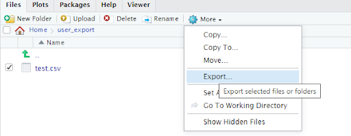

b. **Exporting files from the server via code**

.. code:: 

   file_list = list.files(path=user_file_path, pattern="*.csv")
   for (i in seq_along(file_list)) {
    export_filename = file_list[[i]]
 
    # create a path for file to export
    my_export_file_path <- paste0(user_file_path, export_filename)
 
    # make a pause before exporting the next file, otherwise there can be a pop-up warning
    if (i > 1) {
       cat('*** PRESS ENTER HERE')
      readLines(stdin(), 1)
    }
 
    # export to local disk using browser's capabilities
    browseURL(my_export_file_path)
   }

.. _annex4:

Annex 4: Arena Templates
------------------------
The following screenshots show the templates available in OF collect and Arena

**Forest Inventory Templates**

.. image:: _static/media/Images/Appendices/4/template_e.PNG
   :width: 750
   :align: center
   :alt: Template_E

**Templates for the FAO Forestry Paper 179 "National Socioeconomic Surveys in Forestry"**

.. image:: _static/media/Images/Appendices/4/socio-eceonomic.PNG
   :width: 500
   :align: center
   :alt:  National Socioeconomic Survey

The following handbooks are available:

- English: https://www.fao.org/publications/card/en/c/I6206E/ 
- French: https://www.fao.org/publications/card/en/c/I6206FR/ 
- Spanish: https://www.fao.org/publications/card/es/c/I6206ES/ 

- Forms in English: https://www.fao.org/forestry/forestry-modules/en/

**Landslide Vulnerability Assessment Template :English**

This template was designed for a FAO project in Bangladesh to identify the vulnerable sites and collect robust data on landslide type, frequency, probability, context, composition, class, land cover, and causalities. Around nine hundred sample points data were collected using the Open Foris tools. The collected information was used to develop a functional Landslide Early Warning System for the particular region (https://www.landslidebd.com/coxs-warning/ ). This Arena template is customizable to conduct a similar kind of landslide assessment.

.. image:: _static/media/Images/Appendices/4/landslide.PNG
   :width: 300

.. _annex5:

Annex 5: JSON FIle in Data Processing
-------------------------------------

In the **Chains** section in Arena(located in the Analysis Tab in the main menu), all selections in the “Sampling Design” will be submitted as a JavaScript Object Notation (JSON) file :code:`chain_summary.json` into the R project. The chain section also allows users to export the chain information as a :code:`JSON` file that can be opened in any text editor as they render as plain text files.

To download the JSON file,click on the :guilabel:`Download Summary(JSON)` button loacted on the bottom left of the Chains page. Once downloaded,some tools to view this content include:

- Open the file in NotePad, copy the text and paste it into an online json parser, such as http://json.parser.online.fr/ or
- Use `Notepadd++ <https://notepad-plus-plus.org/>`__, install the plugin **JSON Viewer**, and use this plugin :JSON Viewer > Format JSON.

.. image:: _static/media/Images/Appendices/5/viewing_summary.PNG
   :width: 700
   :align: center
   :alt: Working with JSON files

Annex 6 : Plot Grid Generator for Sampling Point Data
-----------------------------------------------------

Sampling Point Data is a lookup table that can be used to retrieve data into the forms and tables. It can contain for example the predefined list of sampling points, such as clusters and sample plots numbers. It can also contain  properties of these points, such as location (coordinates) and data derived from GIS or other ancillary sources. 

One handy method to generate a spatial grid for Arena is to use the Plot Grid Generator tool, that is available via https://openforis.org/materials/ and Handy Shiny apps section.

Here's the Handy Shiny's `User Guide <https://drive.google.com/file/d/19oxIFQFLA0dCjxM4zBkJbSpUR1IiHYeE/view>`__

.. image:: _static/media/Images/Appendices/6/plot_grid_generator_info.png
   :width: 700
   :align: center
   :alt: Plot Grid Generation
 

Once the grid has been successfully generated, it can be exported as CSV files. The application writes a zip file, that contains the following files:

The file “plot_points_Arena.csv” can look as follows:

.. image:: _static/media/Images/Appendices/6/plot_points_arena_csv.png
   :width: 700
   :align: center
   :alt: Plot grid Generation

This is an hierarchical category table that can be imported into Arena’s categories. Because “label” and “description” do not contain any language codes, these fields will be written into the survey’s default language, i.e. to the first language in the survey (properties).

*location_x, location_y, location_srs* : Point coordinates in EPSG:4326 (latitude-longitude)

*location_map_x, location_map_y, location_map_srs* : point coordinates in imported map’s Spatial Reference System (SRS).

This CSV file can be imported into Arena as a new category with the name **“sampling_point_data”**. Arena will show the following Category Import Summary on the screen:

.. image:: _static/media/Images/Appendices/6/category_import_summary.png
   :width: 700
   :align: center
   :alt: Plot Grid Generation

To import map coordinates, the SRS should be given for the survey, otherwise there will this error message:

.. image:: _static/media/Images/Appendices/6/category_import_warning.png
   :width: 600
   :align: center
   :alt: Import Error Warning

In this case, Arena's Home section should contain the following SRS ; EPSG:32648

.. _privacypolicy:

Annex 7: Privacy Policy
-----------------------

**Effective date: May 1 2021**

The Food and Agriculture Organization of the United Nations ("FAO", "us", "we", or "our") operates the `Open Foris Arena <https://www.openforis-arena.org/>`_  website (the "Service")

This page informs you of our policies regarding the collection, use, and disclosure of personal data when you use our Service and the choices you have associated with that data. This Privacy Policy is powered by `FreePrivacyPolicy.com <https://www.freeprivacypolicy.com/free-privacy-policy-generator.php>`__

We use your data to provide and improve the Service. By using the Service, you agree to the collection and use of information in accordance with this policy. Unless otherwise defined in this Privacy Policy, terms used in this Privacy Policy have the same meanings as in our Terms and Conditions, accessible from https://www.openforis-arena.org/ 

**Use under your own responsibility**

The designations employed and the presentation of material in this information product do not imply the expression of any opinion whatsoever on the part of the Food and Agriculture Organization of the United Nations (FAO) concerning the legal or development status of any country, territory, city or area or of its authorities, or concerning the delimitation of its frontiers or boundaries.

The mention of specific companies or products of manufacturers, whether or not these have been patented, does not imply that these have been endorsed or recommended by FAO in preference to others of a similar nature that are not mentioned.

The views expressed in this information product are those of the author(s) and do not necessarily reflect the views or policies of FAO.

Information Collection and Use
------------------------------
We collect several different types of information for various purposes to provide and improve our Service to you including;

Personal Data
-------------
While using our Service, we may ask you to provide us with certain personally identifiable information that can be used to contact or identify you ("Personal Data"). Personally identifiable information may include, but is not limited to:

- Email Address
- First and last name
- Associated Organization
- TitleCookies and Usage Data
  
Usage Data
----------
We may also collect information on how the Service is accessed and used ("Usage Data"). This Usage Data may include information such as your computer's Internet Protocol address (e.g. IP address), browser type, browser version, the pages of our Service that you visit, the time and date of your visit, the time spent on those pages, unique device identifiers and other diagnostic data.

Tracking and Cookies Data
-------------------------
We use cookies and similar tracking technologies to track the activity on our Service and hold certain information.

Cookies are files with a small amount of data which may include an anonymous unique identifier. Cookies are sent to your browser from a website and stored on your device. Tracking technologies also used are beacons, tags, and scripts to collect and track information and to improve and analyze our Service.

You can instruct your browser to refuse all cookies or to indicate when a cookie is being sent. However, if you do not accept cookies, you may not be able to use some portions of our Service.

Examples of Cookies we use:

- **Session Cookies** - We use Session Cookies to operate our Service.
- **Preference Cookies**- We use Preference Cookies to remember your preferences and various settings.
- **Seurity Cookies** -  We use Security Cookies for security purposes.

Use of Data
-----------
We use the collected data for various purposes:

- To provide and maintain the Service.
- To notify you about changes to our Service.
- To allow you to participate in interactive features of our Service when you choose to do so.
- To provide customer care and support.
- To provide analysis or valuable information so that we can improve the Service.
- To monitor the usage of the Service.
- To detect, prevent and address technical issues.

Transfer of Data
----------------
Your information, including Personal Data, may be transferred to and maintained on computers located outside of your state, province, country or other governmental jurisdiction where the data protection laws may differ from those of your jurisdiction.

Your consent to this Privacy Policy,by your submission of such information represents your agreement to that transfer.

We will take all steps reasonably necessary to ensure that your data is treated securely and in accordance with this Privacy Policy and no transfer of your Personal Data will take place to an organization or a country unless there are adequate controls in place including the security of your data and other personal information.

Disclosure of Data
------------------
Legal requirements
^^^^^^^^^^^^^^^^^^
We may disclose your Personal Data in the good faith belief that such action is necessary to:

- To comply with a legal obligation
- To protect and defend the rights or property of FAO
- To prevent or investigate possible wrongdoing in connection with the Service
- To protect the personal safety of users of the Service or the public
- To protect against legal liability

Security of Data
----------------
The security of your data is important to us, but remember that no method of transmission over the Internet, or method of electronic storage is 100% secure. While we strive to use commercially acceptable means to protect your data, we cannot guarantee its absolute security.

Service Providers
-----------------
We may employ third party companies and individuals to facilitate our Service ("Service Providers"), to provide the Service on our behalf, to perform Service-related services or to assist us in analyzing how our Service is used.

These third parties have access to your Personal Data only to perform these tasks on our behalf and are obligated not to disclose or use it for any other purpose.

Analytics
---------
We use third-party Service Providers to monitor and analyze the use of our Service.

**Google Analytics**

Google Analytics is a web analytics service offered by Google that tracks and reports website traffic. Google uses the data collected to track and monitor the use of our Service. This data is shared with other Google services. Google may use the collected data to contextualize and personalize the ads of its own advertising network.

You can opt-out of having made your activity on the Service available to Google Analytics by installing the Google Analytics opt-out browser add-on. The add-on prevents Google Analytics JavaScript (ga.js, analytics.js, and dc.js) from sharing information with Google Analytics about visits activity.

For more information on the privacy practises of Google, please visit the Google Privacy & Terms web page: https://policies.google.com/privacy?hl=en

Links to Other Sites
--------------------
Our Service may contain links to other sites that are not operated by us. If you click on a third party link, you will be directed to that third party's site. We strongly advise you to review the Privacy Policy of every site you visit.

We have no control over and assume no responsibility for the content, privacy policies or practices of any third party sites or services.

Maps
----
The designations employed and the presentation of material in the map(s) do not imply the expression of any opinion whatsoever on the part of FAO concerning the legal or constitutional status of any country, territory or sea area, or concerning the delimitation of frontiers.

Electronic Products
-------------------
FAO declines all responsibility for errors or deficiencies in the database or software or in the documentation accompanying it, for program maintenance and upgrading as well as for any damage that may arise from them. FAO also declines any responsibility for updating the data and assumes no responsibility for errors and omissions in the data provided. Users are, however, kindly asked to report any errors or deficiencies in this product to FAO.

Children's Privacy
------------------
Our Service does not address anyone under the age of 18 ("Children").

We do not knowingly collect personally identifiable information from anyone under the age of 18. If you are a parent or guardian and you are aware that your Children have provided us with Personal Data, please contact us. If we become aware that we have collected Personal Data from children without verification of parental consent, we take steps to remove that information from our servers.

Changes to this Privacy Policy
------------------------------
We may update our Privacy Policy from time to time. We will notify you of any changes by posting the new Privacy Policy on this page.

We will let you know via email and/or a prominent notice on our Service, prior to the change becoming effective and update the "effective date" at the top of this Privacy Policy.

You are advised to review this Privacy Policy periodically for any changes. Changes to this Privacy Policy are effective when they are posted on this page.

Contact Us 
----------
If you have any questions about this Privacy Policy, please contact us by email: **openforisinitiative@gmail.com**

**Open Foris Arena is developed,hosted and maintained by the Forestry Division of the Food and Agriculture Organization (FAO)**

.. This indices and tables can be adapted later if needed be;
.. Indices and tables
.. =====================
.. * :ref:`genindex`
.. * :ref:`modindex`
.. * :ref:`search`

.. rubric:: Footnotes

.. [#] RStudio requires R (https://cran.r-project.org/).RStudio is available at https://posit.co/download/rstudio-desktop/ .Read more about the requirements for R version and RStudio in this chapter

.. [#] Notice that Arena does not contain all Collect’s custom functions, yet. Unsupported are e.g. env:desktop(), env:mobile()

.. [#] Earth Map uses GeoJSON geometries and there is no circle geometry. Therefore Arena “simulates" a circle with a multi-vertex polygon in Earth Map.

.. [#] List of packages cane be found at /system/init/init-packages.R

.. [#] Methods for double sampling for stratification and two stage sampling with simple random sampling are under development.Post-stratification will be added later in 2023.